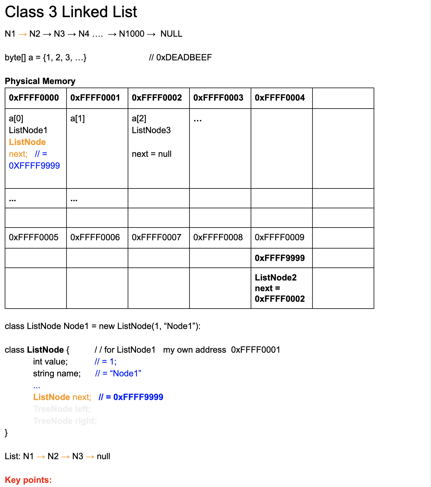
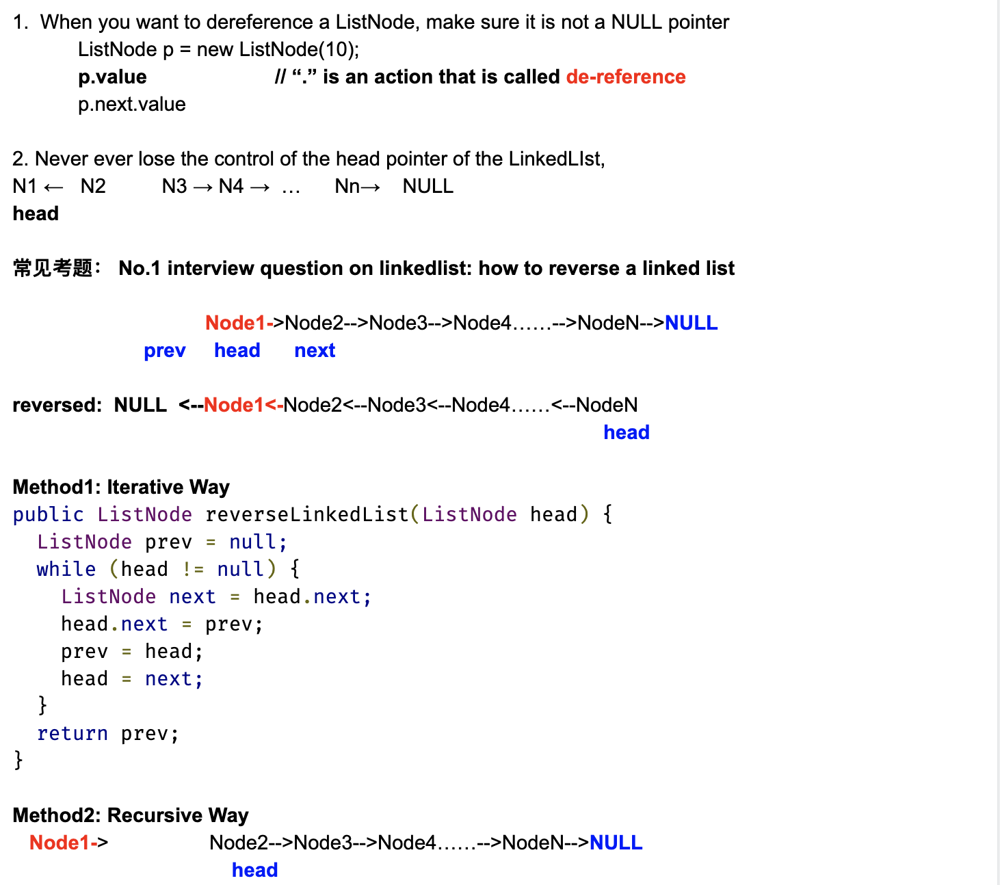
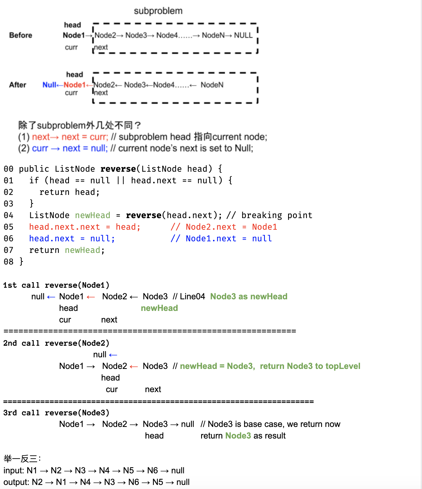
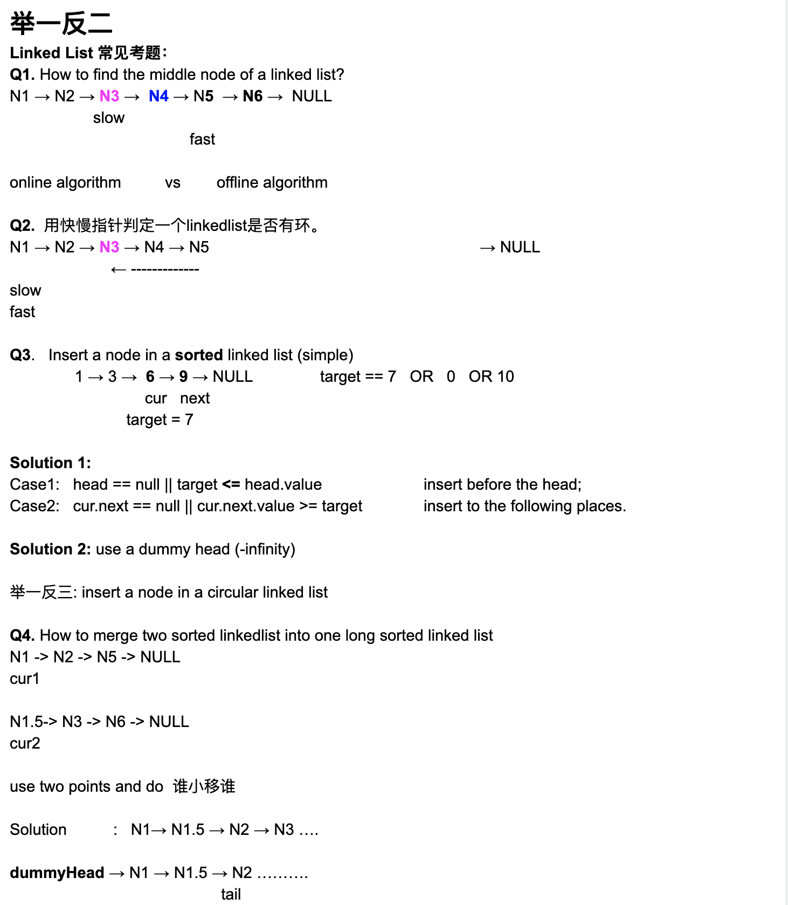
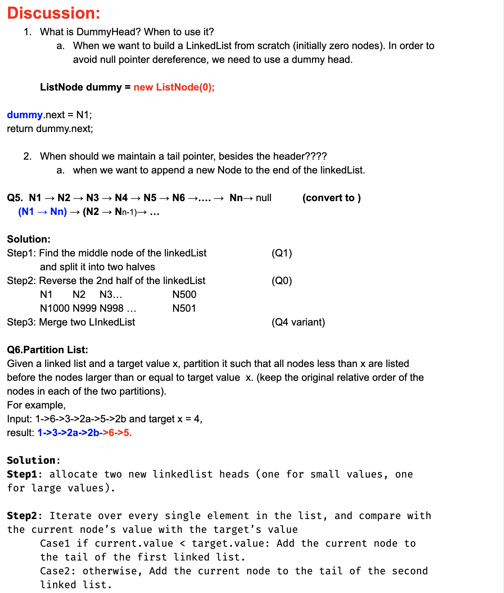
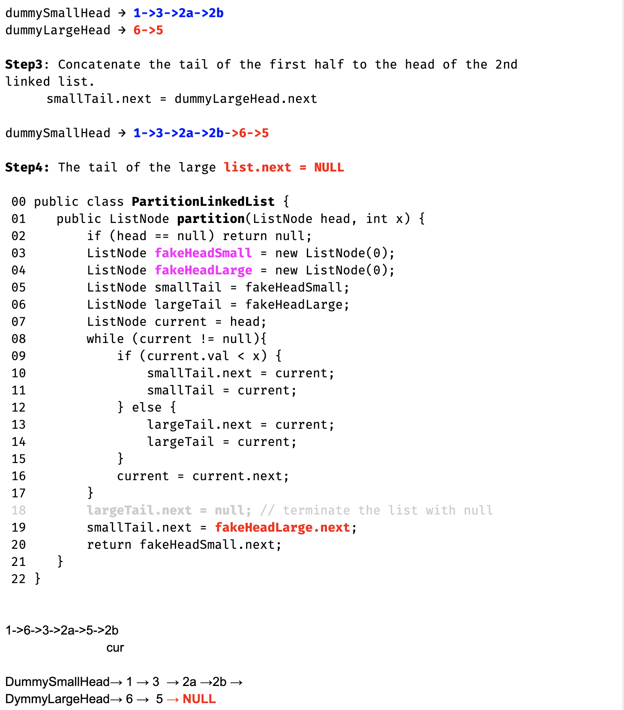
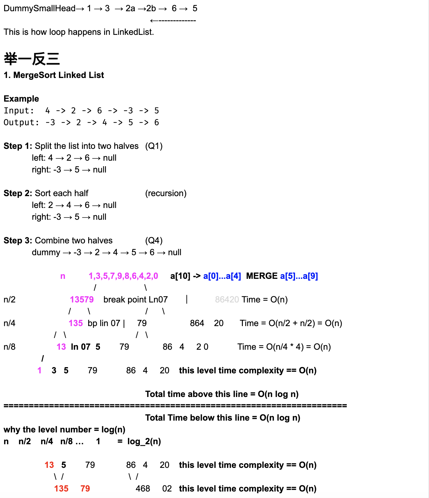
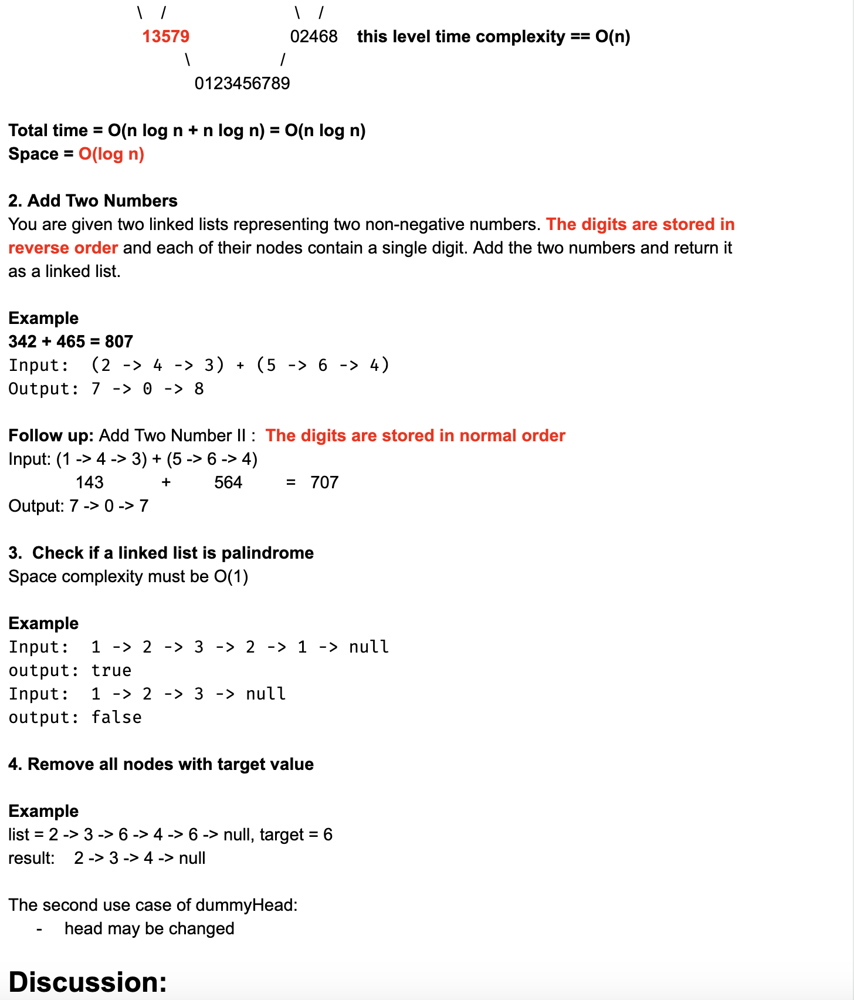
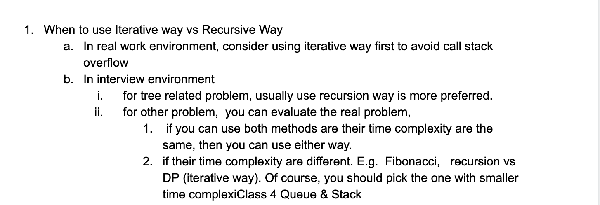

# Class3 Linked List











---

## How to reverse a linked list

- [Iterative Way](https://novemberfall.github.io/Algorithm-FullStack/ch3/ListReverse1.html)


- [Recursive Way](https://novemberfall.github.io/Algorithm-FullStack/ch3/ListReverse.html)


```java
class ListNode {
   public int value;
   public ListNode next;
   public ListNode(int value) {
     this.value = value;
      next = null;
   }
 }


public class reverse {
    public static ListNode reverseLinkedList(ListNode head){
        if(head == null || head.next == null){
           return head;
        }

        /* 
        当第一次pop from stack,  head.next = newHead = L3, [L1 L2],   head -> L2
        call ListNode newHead = reverseLinkedList(head.next);  =>  newHead = L3, head = L2
        head.next.next = head;      =>  L3.next -> L2   =>      L2 <-> L3
        head.next = null;           =>  L2.next -> null =>      L2 <- L3

        head = L1 
        head.next.next = head;      =>  L2.next -> L1   =>      L1 <-> L2
        head.next = null;           =>  L1.next -> null =>      L1 <- L2 <- L3
        */
        ListNode newHead = reverseLinkedList(head.next); 
        head.next.next = head;
        head.next = null;
        return newHead;
    }

    public static void main(String[] args) {
        ListNode L1 = new ListNode(3);
        ListNode L2 = new ListNode(5);
        ListNode L3 = new ListNode(7);
        L1.next = L2;
        L2.next = L3;

        ListNode head = reverseLinkedList(L1);
        //当递归调用结束， 赋值给 L3 -> L2 -> L1, 
        /* 
        L3          ; L3 == head
        L2          ; L2 == head
        L1          ; L1 == head
         */
        while(head != null){
            System.out.println(head.value);
            head = head.next;
        }
    }
}
```


### Q1: How to find the middle node of a linked list?

- [36. Middle Node Of Linked List](https://novemberfall.github.io/Algorithm-FullStack/ch6/midNodeOfList.html)


---


### 用快慢指针评定一个linkedlist是否有环


- [37. Check If Linked List Has A Cycle 这是一个find middle node的变种](https://novemberfall.github.io/Algorithm-FullStack/ch6/check_cycle.html)