# Class1 Binary Search

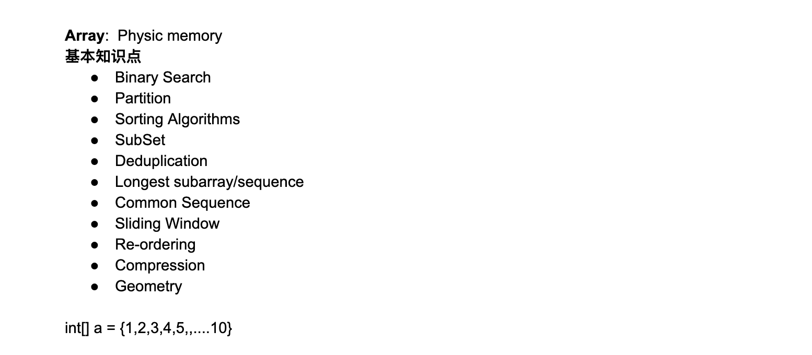

---


## Binary Search

- Common assumptions: Array has to be sorted. ascending or descending (Is this necessary?)

- Not necessarily the case      

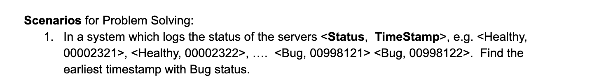
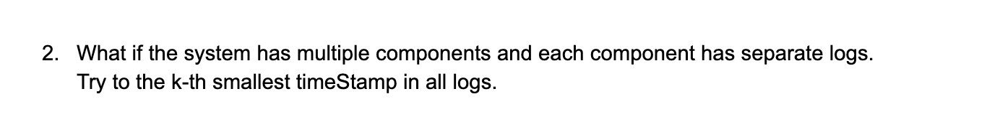


- 基础： https://novemberfall.github.io/Algorithm-FullStack/csBasic/binarySearch.html

### Question 1 : Classical Binary Search

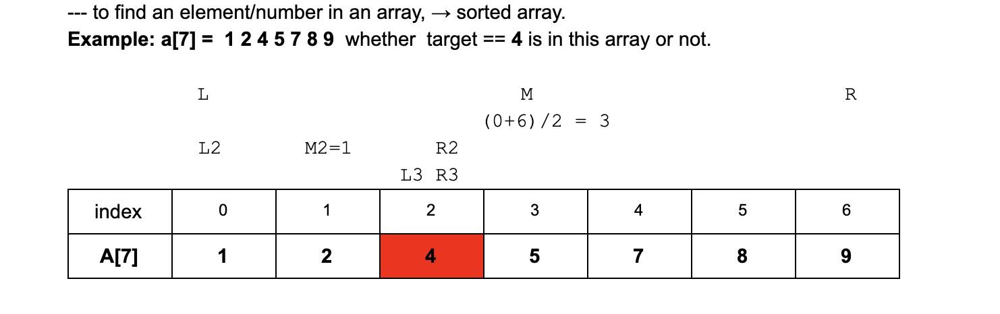

```java
public class Solution {
  public int binarySearch(int[] array, int target) {
    // Write your solution here
    if(array == null || array.length == 0){
      return -1;
    }
    int left = 0;
    int right = array.length - 1;
    while(left <= right){
      int mid = left + (right - left) / 2;
      if(array[mid] == target){
        return mid;
      }
      if(array[mid] > target){
        right = mid - 1;
      }else if(array[mid] < target){
        left = mid + 1;
      }
    }
    return -1;
  }
}
```

- Time = O(log n)

- Extra space = O(1)

---


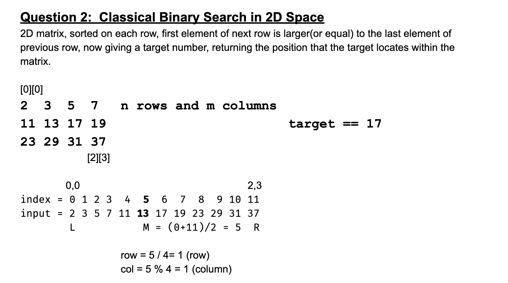

```java
Given a 2D matrix that contains integers only, which each row is sorted in an ascending order. 
The first element of next row is larger than (or equal to) the last element of previous row.

Given a target number, returning the position that the target locates within the matrix. 
If the target number does not exist in the matrix, return {-1, -1}.

Assumptions:
The given matrix is not null, and has size of N * M, where N >= 0 and M >= 0.


Examples:

matrix = { {1, 2, 3}, {4, 5, 7}, {8, 9, 10} }

target = 7, return {1, 2}

target = 6, return {-1, -1} to represent the target number does not exist in the matrix.
```


```java
public class Solution {
  public int[] search(int[][] matrix, int target) {
    // Write your solution here
    int left = 0;
    int row = matrix.length;
    int col = matrix[0].length;
    int right = row * col - 1;
    while(left <= right){
      int mid = (left + right) / 2;
      int r = mid / col;
      int c = mid % col;
      if(matrix[r][c] == target){
        return new int[]{r, c};
      }else if(matrix[r][c] > target){
        right = mid - 1;
      }else{
        left = mid + 1;
      }
    }
    return new int[]{-1, -1};
  }
}

```

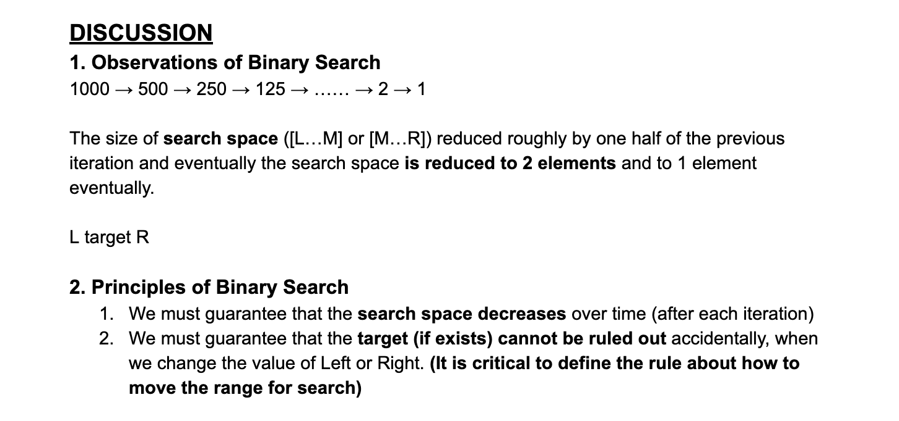

---

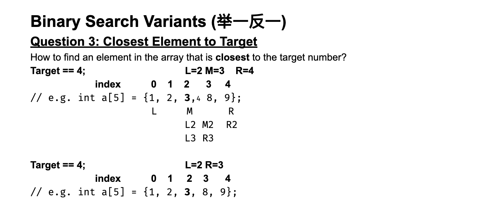

```java
Given a target integer T and an integer array A sorted in ascending order, 
find the index i in A such that A[i] is closest to T.

Assumptions:
There can be duplicate elements in the array, and we can return any of the indices with same value.


Examples:
A = {1, 2, 3}, T = 2, return 1
A = {1, 4, 6}, T = 3, return 1
A = {1, 4, 6}, T = 5, return 1 or 2
A = {1, 3, 3, 4}, T = 2, return 0 or 1 or 2


Corner Cases:
What if A is null or A is of zero length? We should return -1 in this case.
```

```java
public class Solution {
  public int closest(int[] array, int target) {
    // Write your solution here
    if(array == null || array.length == 0){
      return -1;
    }
    
    int left = 0;
    int right = array.length - 1;
    while(left < right - 1){
      int mid = left + (right - left)/2;
      if(array[mid] == target){
        return mid;
      }else if(array[mid] > target){
        right = mid;
      }else{
        left = mid;
      }
    }
    
    if(Math.abs(array[left] - target) <= Math.abs(array[right] - target)){
      return left;
    }else{
      return right;
    }
  }
}
```

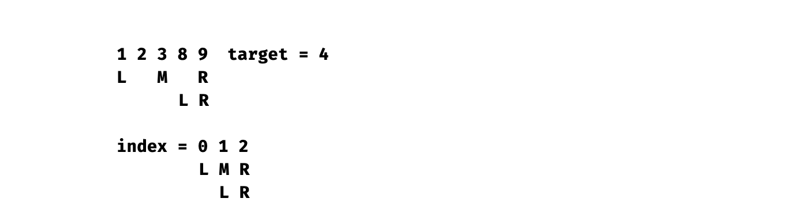

---


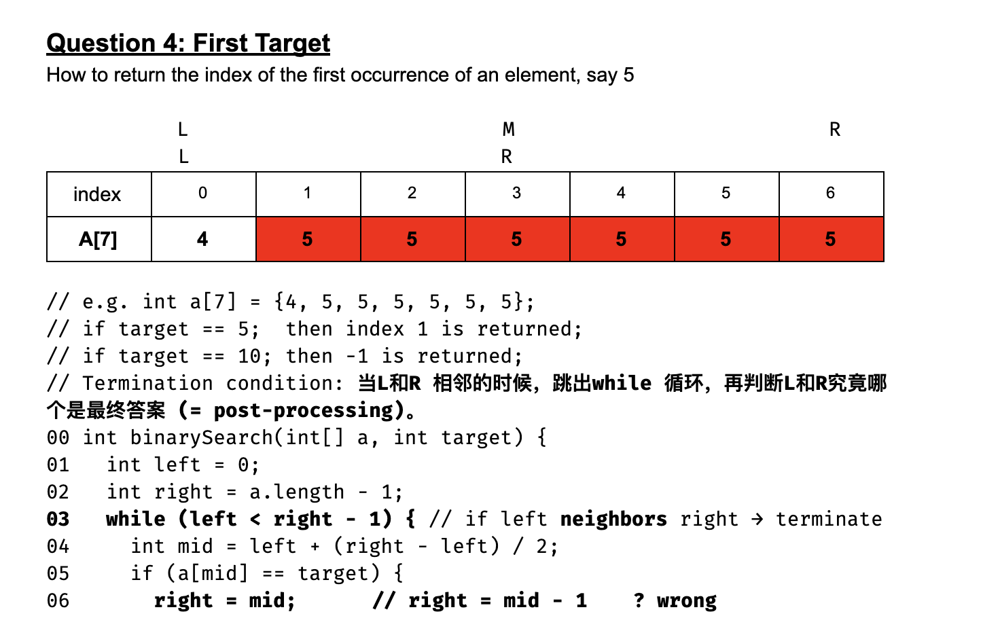
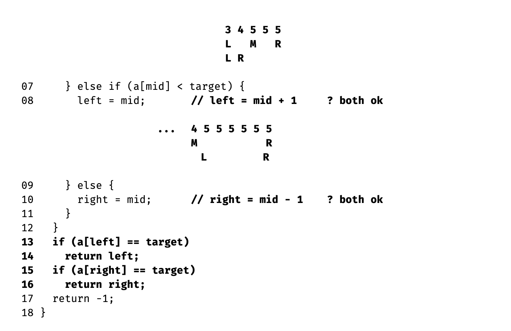

```java
public class Solution {
  public int firstOccur(int[] array, int target) {
    // Write your solution here
        if(array == null || array.length == 0){
            return -1;
        }
        int left = 0;
        int right = array.length - 1;

        while(left < right - 1){
            //while terminal condition: left == right - 1;    区间为[ )
            int mid = (left + right) / 2;
            if(array[mid] >= target){
                right = mid;
            }else{
                left = mid;
            }
        }
/*         assume: [1, 2, 2, 2, 4]
                          R            //mid = (0 + 4)/ 2 = 2,   R = 2,  left = 0, left < (R - 1) = 3   
                       R               //mid = (0 + 2)/ 2 = 1,   R = 1,   left = 0, left < (R - 1) = 1
                                       //left = 0, left == right - 1 = 0, termination
 */
        if(array[left] == target){
            return left;
        }else if(array[right] == target){
            return right;
        }
        return -1;

  }
}
```

- [具体另一种思路可以参考 fucking-algorithm/算法思维系列/二分查找详解.md](https://github.com/labuladong/fucking-algorithm/blob/master/%E7%AE%97%E6%B3%95%E6%80%9D%E7%BB%B4%E7%B3%BB%E5%88%97/%E4%BA%8C%E5%88%86%E6%9F%A5%E6%89%BE%E8%AF%A6%E8%A7%A3.md)

---


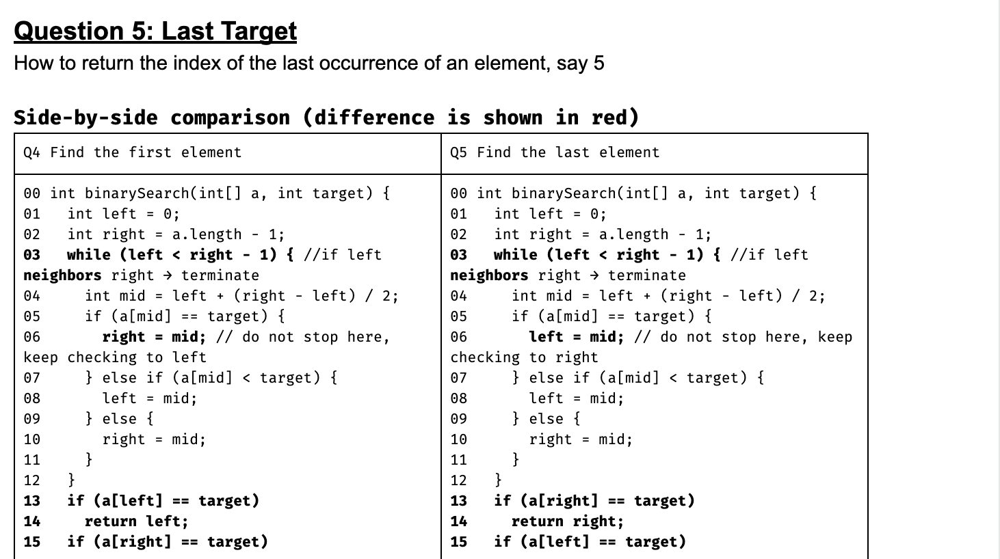
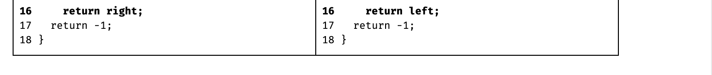

---

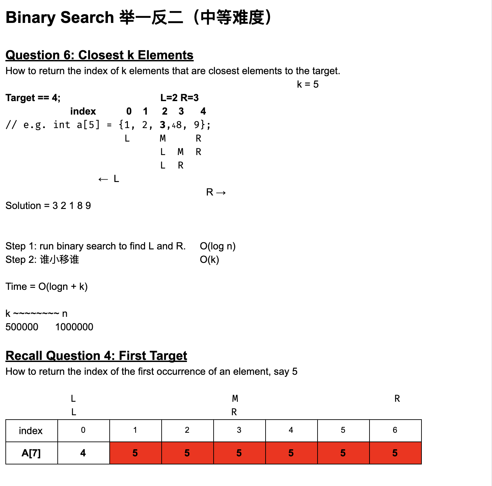


