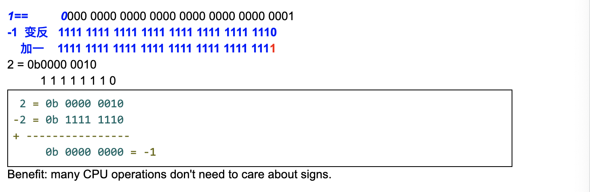

# Class11 Bit Representation $ Bit Operations

- Decimal representation:
  $$2084 = 2*10^3 + 0*10^2 + 8*10^1 + 4*10^0$$
  逢十进一

- Binary representation:
  $$5 = 1*2^2 + 0*2^1 + 1*2^0$$
  = 0b101


## Why do we need to learn bit representation?

- Computer hardware represents numbers in binary.
- Optimization especially infrastructure code

- 正数的表示：
  "5"   0000 0000 0000 0000 0000 0000 0000 0101     least significant bit
                                    $$ 1*2^2 + 1*2^0 = 5 $$

- 最左边的一位(most significant bit)是符号位， 0:positive number; 1: negative number
- C++ int/Java int (signed 32-bit). max value = 2^31 - 1
- max int = 011111...111 (31 ones) = 2^31 - 1 = 2147483647
- max long = 01111...111 (63 ones) = 2^63 - 1 

- Java int = 2^31 - 1
- Java long = 2^63 - 1


- O(nlogn) vs O(n)


## 负数的表示

- Two's complement(补码)
- 对于负数"-1":  1变反加1，




## Bit Operation

- & bitwise AND (ampersand) 
  - bitwise and (for each bit)
  - Difference: && uses short-circuit evaluation


```ruby
    0b11001110  (-50)
&   0b10011000  (-104)
=   0b10001000  (-120)

byte a = -50;
byte b = -104;
byte c = a & b;  // c == -120
```