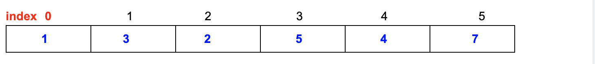

# Class6 Heap & Graph Search Algorithms |

- 堆（min/max - heap） 也叫做： 优先队列（priority queue）

- 用途： 维护一个**变化**的数据集的**最优值**

- Example:


```java
        1
      /    \
     3      2
   /  \    /  \
  5   4   7    null  
```



- Property: 堆的实现通过构造二叉树(binary heap), 这种数据结构具有以下的性质：

    1. 堆总是一棵完全二叉树。 complete binary tree
        - [A heap can be seen as a complete binary tree]
  
    2. 任意节点 小于 (等于) 它的所有后裔(descendent) （堆序性）
        - 什么叫堆序性？ -> 1 < (3, 2)   3 < (5, 4)   2 < (7, )
        - 只要满足上下大小关系，左右不重要

- 根节点最小的堆叫做最小堆min Heap. 将根节点最大的堆叫做max Heap


- **Implemented as unsorted array**

    1. index of LeftChild = my index * 2 + 1
    2. index of RightChild = my index * 2 + 2
    3. index of parent = (my index - 1)/2


- Operations:
  
    1. insert: 向堆中间插入一个元素； Time Complexity **O(log(n))**   - percolateUp (渗透)
    2. update: 将新匀速提升使其符合堆的性质； time complexity **O(log(n))**
    3. get/top: 获取当前堆顶元素的值； time complexity **O(1)**
    4. pop: 删除堆顶元素； time complexity **O(log(n))**    - percolateDown
    5. **heapify**: 使得一个unsorted array变成一个堆。 time complexity **O(n)**
        
        [5.1. HeapSort](https://en.wikipedia.org/wiki/Heapsort)


- Operations: how to delete?
        - 注意不能谁小冒泡谁，应该从最尾巴开始往上冒泡，
        - 如果从最小开始往上冒泡 => 产生气泡，无法maintain 堆序性 

```java
假设把 1 删除， => empty

        1
      /    \
     3      2
   /  \    /  \
  5   4   7    null  


       empty
      /    \
     3      2
   /  \    /  \
  5   4   7    null  

 
 
 //7 往上冒泡
         7
      /    \
     3      2
   /  \    /  \
  5   4  null  null   


 //maintain 堆序性
         2
      /    \
     3      7
   /  \    /  \
  5   4  null  null    

```

---

## Q1 Find smallest k elements from an unsorted array of size n

- Solution 0 sort ->     $$O(n log n)$$


- Solution 1 (min heap) [heapify]
   
    - Step 1: heapify all elements ->     $$O(n)$$
    - Step 2: call pop() k times to get the k smallest elements.  ->  $$O(klogn)$$
    - Time =    $$O(n + klogn)$$


- **Solution 2 (max heap of size k -> smallest k candidates) online algorithm k = 7**

```ruby
e.g. 1 2 3 8 5 6 4 7 9 ...

1 2 3 8 5 6 4 || 7 9

Step 1: heapify the first k element to form a max-heap of size 
        = k (solution so far) -> O(k)
        alternatively, call insert() k times instead of heapify -> O(k log k)
Step 2: Iterate over the remaining (n-k) elements one by one.
        when we traverse a new element:
                compare with the LARGEST element of the previous smallest k candidates.
                        Case 1: new element >= top: ignore
                        Case 2: new element < top: update(top -> new element)
        Time of step2 = O((n-k)log k)
Total time = O(k + (n-k) log k)

Compare                  O(n + k log n)     vs       O(k + (n-k) log k)
k << n                   O(Constant * n)             O(n log k)              hard to say
k ~~ n (e.g. k=0.5n)     O(n log n)                  O(n log n)              hard to say    


______________________________________

Min heap                vs              Max heap
O(n) + O(k log(n))                      O(k) + O(n-k)lon(k)

Case 1  k <<<<< n
        c* n            hard to say                n log(k)
Case 2  k ~~~~~ n
        nlog(n)         hard to say             nlog(n)
```


- Worst time =    $$O(n^2)$$

```ruby

Solution 3 (quick select)
n = 1000   k = 20

Round1:
                       
xxxxxxxxxxxxxxxxxxxxxxxxP1xxxxxxxxxxx           n == 1000
L                               <- R
               


                        601
xxxxxxxxxxxxxxxxxxxxxxxxP1xxxxxxxxxxx           n == 1000
L                               <- R
                600       399


                        601
xxxxxxxxxxxxxxxxxxxxxxxxP1                      n == 600
L                               <- R
                600       399  
                

Round2:

3   4                    601
xxx P2 xxxxxxxxxxxxxxxxxxxxx           n == 600
L                               <- R
                600       399

in the 2nd roud, we found the first 4 smallest element in blue color

soln = {xxx P2}


3   4                    601
xxx P2 xxxxxxxxxxxxxxxxxxxxx           n == 600  k = 20
L                               <- R
                600       399


                           601
[xxx P2] xxxxxxxxxxx P3 xxxxxxxxxx           n == 596  k = 20 - 4 == 16
L                               <- R
                600       399


n
n/2
n/4
n/8
...

quickSelect average time = O(n) = n + n/2 + n/4 + ... 8 + 4 + 2 + 1 = O(2n)


soln = {xxx P2}
```


---


## Graph


- **Pros**: Representation is easy to implement. Edge removal takes 0(1) time. 
  Queries like whether there is an edge from vertex `u` to vertex `v` are
  effecient and can be done O(1).

- **Cons**: Consumes more space $$O(V^2)$$ (**V is the number of vertex/node**) 
  Even if the graph is sparse(constains less number of edges) = waste of space


        4.2 Adjacency List

        0  1 -> 4
        1  0 -> 4 -> 3 -> 2
        2  1 -> 3
        3  1 -> 4 -> 2
        4  3 -> 0 -> 1

        Vertices/nodes  V
        Edges:          E


- **Pros**: Space complexity = O(V+E).  Adding a vertex/node to the graph is easier

- **Cons**: Time complexity is O(V) to check whether there is an edge from a node
  to the other. (compared to 0(1) in adjacent matrix)


```java
<key = node, value = <HashSet>>
        0            {1, 4}
        1            {0, 4, 3, 2}


class GraphNode{
        List<GraphNode> neighbors;
}


class TreeNode{
        TreeNode left;
        TreeNode right;
}
```

---


## 图里常用的search  算法

    1. Breadth-First Search (BFS-1)

```java
expand: 中心开花, 往外延展

                1   expand(1) -> generate(3) and generate(2)    
              /    \
             3      2
           /  \    /
          5    4  7
         / \
        9  11


class GraphNode{
        int value;
        String name;
        ...
        List<GraphNode> neighbors;
}


FIFO queue = {1 }

expand(1) -> generate(3) and generate(2)    

FIFO queue = {3 2}


expanded node = {1}


FIFO queue = { 2}    expand(3) -> generate(5) and generate(4)    

expanded node = {1 3}


FIFO queue = { 2 5 4}

expanded node = {1 3}


FIFO queue = {5 4}

expanded node = {1 3 2}   expand(2) -> generate(7)


FIFO queue = {5 4 7}

expanded node = {1 3 2}


---
FIFO queue = {7 9 11}
BFS-1 order: 1 3 2 5 4

Set: wich nodes have been generated so far
```

---


### BFS的操作过程 & How to describe a BFS's action during an interview?    

  - Data Structure : Maintain a FIFO queue, put all traversed nodes that haven't been

    expanded. e.g. and then 2 into the queue(FIFO) queue head -> [3,2] tail
  
  - Initial state
  - **Expand** a node s, e.g. visit/print its value ...
  - **Generate** s's neighbor nodes: reach out to its neighboring nodes.      
  - **Termination condition**: do a loop until the queue is empty.   
  - Optionally **deduplicate** visited nodes (typically for graph not for tree)
    - e.g. each node is expanded only once
    - e.g. each node is generated only once

---
FIFO queue = {}

BFS order: 1 3 2 5 4 7 9 11


---

## 经典题目1: 分层打印一个binary tree: (Print Tree in Level Order)

```ruby
expand: 中心开花, 往外延展

                1   expand(1) -> generate(3) and generate(2)    
              /    \
             3      2
           /  \    /
          5    4  7
         / \
        9  11

Output:
1       newline
3 2     newline
5 4 7           newline
9 11    newline


Data structure: FIFO queue
Algorithm: BFS1

Initialization: queue = {root}
For each step:
1. Record the size (=k) of the queue
2. k次 expand + generate
```


```java
//param: root - the root of the tree
public void PrintNodeByLevel(Node root){
        if(root == null){
                return;
        }
        Queue<Node> q = new ArrayDeque<Node>();
        q.offer(root);
        while(!q.empty()){
                int size = q.size(); //size = # of nodes in the current layer.
                for(int i = 0; i<size; i++){
                        Node n = q.poll();
                        if(n.left != null){
                                q.offer(n.left);
                        }
                        if(n.right != null){
                                q.offer(n.right);
                        }
                        System.out.print(n.val + " ");
                }
                System.out.println();
        }
}
```

- Time Complexity = O(n)
- space Complexity = O(n)


- 具体可以参考leetCode: [102. Binary Tree Level Order Traversal](https://novemberfall.github.io/LeetCode-Algorithm/m6/printByLayer.html)
- 以及倒叙打印每一层： [107. Binary Tree Level Order Traversal](https://novemberfall.github.io/LeetCode-Algorithm/m6/printByLayer1.html)

---


- Data structure: FIFO queue


- 注意： U , V 两组set, 里面的node 没有上下相邻的边, 那么边一定是 U , V 之间node相连

```js
- 首先证明三角形不是 bipartitle

Round1:

1(u) - 2(v)
 \      /
   3(v)

queue = {1(u)}


queue = {}

u                       v

1(u)                    ?


queue = {2(v), 3(v)}


queue = {}

u                       v

1(u)                    ?


============================

Round 2:


1(u) - 2(v)
 \      /
   3(v != u)

queue = {, 3(v)}


queue = {}

u                       v

1(u)                    2(v)

这里由于 3v 已经被 1(u) generate 到 v 里去了，然后2(V) 的邻边 到 U， 3(v != u), 所以
这里冲突，所以三角形不是  bipartite

Critical Point: one node can only be popped out of the queue for expansion once
and only once


=============================

那么 正方形是 bipartite

1---2
|   |    
3---4

u               v
1               2
4               3
```

---


## 经典例题3: Determine whether a binary tree is a complete binary tree

```ruby
         1
       /   \
      3      2
     / \    / \
    5   4 null  9
   / \ /  \
 null null null null
 
 直观印象： 一旦遇到气泡，就不可以再遇到任何数字
 
 queue = {5 4}
 flag = true

BFS-1
Data structure
    FIFO queue
    flag: whether i detected bubbles
Expand: dequeue

Generate:
    when the flag is off, if the left child or the right child is null, set the flag
    when the flag is on, if the left child or the right child is not null, return false

Terminate:
    queue is empty or return flase in the generation process


Solution:
BFS: expand + generate
Case 1: left = null, right = non-null, return false
Case 2: After detecting the first node that misses on child, then check whether 
all following nodes expanded to see whether they have any node generated (if any-> then false)


          1
        /    \
       3       2 
     /  \     /  \
    5     4  7   null
  /  \   /  \
  9  11 null null

1 3     2       5 4 7

```

2. Best First Search (BFS-2)

经典算法： Dijkstra's Algorithm 

- [runtime efficiency improvement: A* algorithm](https://en.wikipedia.org/wiki/A*_search_algorithm)

    1. **Usages**: Find the **sortest path cost** from a single node(sorce node) to 
       **any other nodes** in that graph (点到面(==所有点)的最短距离算法)
    2. **Example problem**: 从北京到中国其它所有主要城市的最短距离是多少
    3. Data structure: **priority_queue**(MIN_HEAP)


---

Data structure:
**Priority queue (min heap)**:

Expanded nodes: <4, 0> <6, dist=1> <3, dist=1> <5, 3> <1, 3>

Algorithm:

Initialize: enqueue <the source code, 0>

For each step:

Expand:
  - dequeue the node (x) with the smallest distance from the source - O(logn)
  - **dedup: if x has been expanded before, don't generate anything** 

Generate:
  - enqueue all neighbors <the neighbor, dist(x) + weight(x->y)>
      O(# of outgoing edges * logn)
  - if(dist(x) + weight(x -> y) >= dist(y)), ignore
  - if(dist(x) + weight(x -> y) < dist(y)), enqueue
  
Terminate:
  - The queue is empty

Dedup:
  - each node is expanded only once


**解题思路**：
  - Initial state (start node)
  - Node expansion/Generation rule:
  - Termination condition: 所有点都计算完毕才停止，也就是p_queue变空
  
Example:
  - start node is **4**
  - cost(node) = cost(parent of node) + c(parent of node, node)
      e.g. cost(2) = cost(3) + c(3, 2) = 1 + 1 = 2
  - **Cost[4, 5] = 10;**
  - Cost for all the rest edges = 1;


  - **Step 0 (initial state)**: No nodes have been expanded, Node(4, 0)
  - step 1: pop node(4,0) out of the p_queue, Expand Node(4, 0) generate
    three successors:           **KEY1 = 0**
        1. Node(5, 10)
        2. Node(3, 1)
        3. Node(6, 1)

  - Step2: pop node(6,1) generate nothing p_queue = {Node(5, 10), Node(3, 1)}
        **KEY2 = 1**
