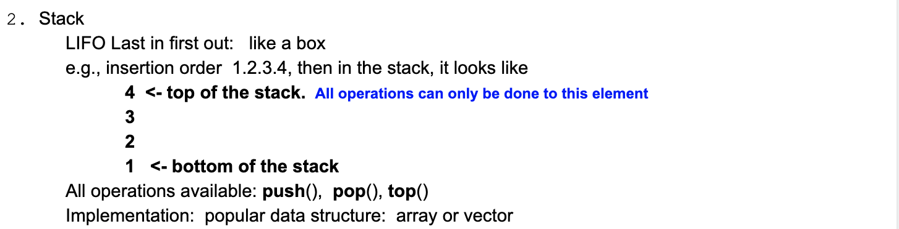
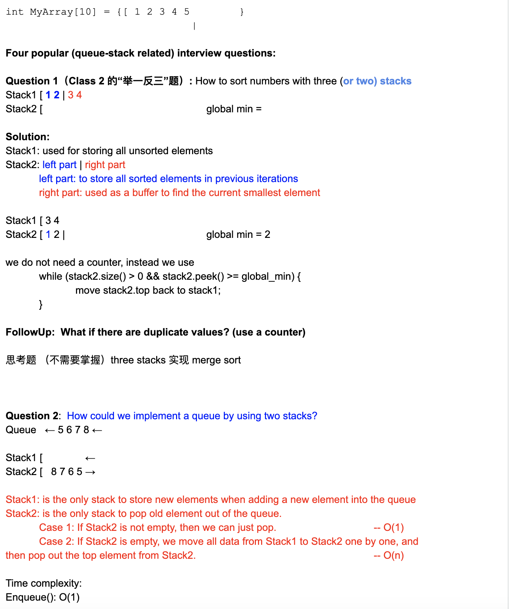
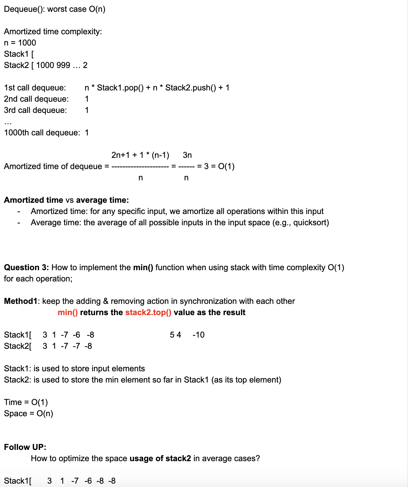
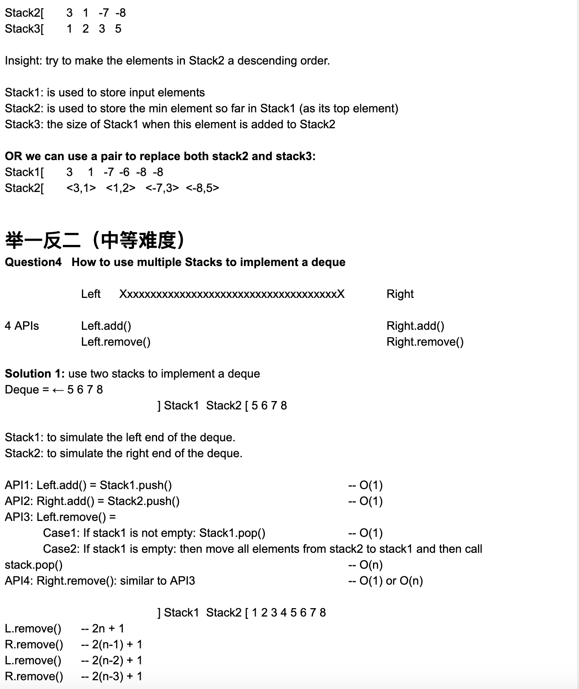
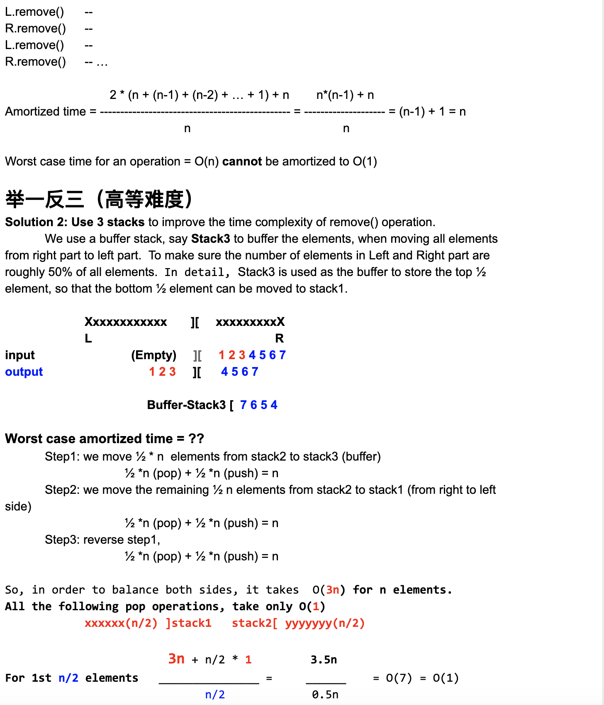
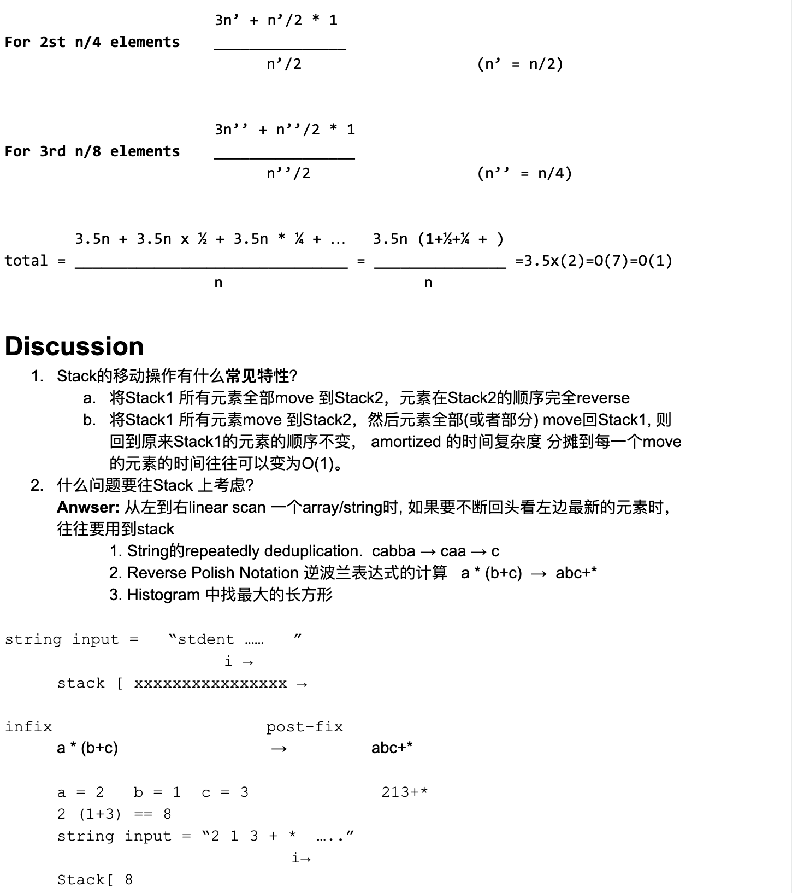
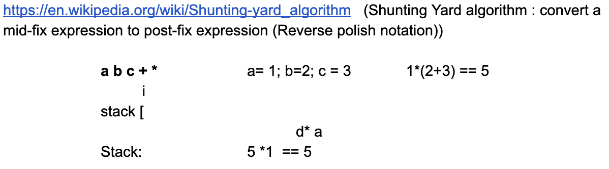

# Class4 Queue & Stack

### Queue

1.1 Example: wait in a line, FIFO == First in first out
1.2 Usages: Breadth-First Search related problems
1.3 c++ [reference](http://www.cplusplus.com/reference/queue/queue/)
1.4 classical problem:

        - Tree printout by level

        - Sliding window problem (Deque: double ends manipulation)

Queue = {p2 p3 p4}

    head    tail

    XXXXXXXXXXXXXXXXXXXXXXXXXXXXXXXXXXXXXXXX    

### Stack

- https://en.wikipedia.org/wiki/Shunting-yard_algorithm

