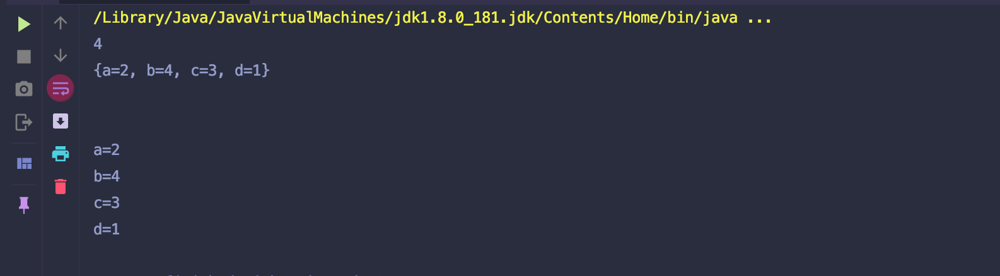

# Top K Frequent Words - HashTable test

```ruby
Given a composition with different kinds of words, 
return a list of the top K most frequent words in the composition.

Assumptions

the composition is not null and is not guaranteed to be sorted
K >= 1 and K could be larger than the number of distinct words in the composition, 
in this case, just return all the distinct words

Return

a list of words ordered from most frequent one to least frequent one 
(the list could be of size K or smaller than K)

Examples

Composition = ["a", "a", "b", "b", "b", "b", "c", "c", "c", "d"], 
top 2 frequent words are [“b”, “c”]

Composition = ["a", "a", "b", "b", "b", "b", "c", "c", "c", "d"], 
top 4 frequent words are [“b”, “c”, "a", "d"]

Composition = ["a", "a", "b", "b", "b", "b", "c", "c", "c", "d"], 
top 5 frequent words are [“b”, “c”, "a", "d"]
```

---


```java
public class topKfreqWords {
    public String[] topKFrequent(String[] combo, int k) {
        //handle the special case of empty combo at the very beginning.
        if(combo.length == 0){
            return new String[0];
        }
        //get all the distinct strings as keys and their frequencies as values.
        //NOTICE: the freqMap has at least size 1.
        Map<String, Integer> freqMap = getFreqMap(combo);
        //minHeap on the frequencies of the strings.
        //NOTICE: using Map.Entry as the element type directly so that all the
        //operations are mostly efficient.
        PriorityQueue<Map.Entry<String, Integer>> minHeap
                = new PriorityQueue<>(k, new Comparator<Map.Entry<String,Integer>>(){
            @Override
            public int compare(Map.Entry<String, Integer> e1,
                               Map.Entry<String, Integer> e2){
                //compare the frequencies, directly call the compareTo method since
                //the frequencies are represented by integer.
                return e1.getValue().compareTo(e2.getValue());
            }
        });

        for(Map.Entry<String, Integer> entry : freqMap.entrySet()){
            if(minHeap.size() < k){
                minHeap.offer(entry);
            }else if(entry.getValue() > minHeap.peek().getValue()){
                minHeap.poll();
                minHeap.offer(entry);
            }
        }
        //Since the returned array requires the strings sorted by their
        //frequencies, use a separate helper method to do this operation.
        return freqArray(minHeap);
    }

    private Map<String, Integer> getFreqMap(String[] combo){
        Map<String, Integer> freqMap = new HashMap<>();
        //NOTICE: when possible, choose the most efficient way for
        //HashMap operations.
        for(String s: combo){
            Integer freq = freqMap.get(s);
//            System.out.println("Key: " + freq);
            if(freq == null){
                freqMap.put(s, 1);
            }else{
                freqMap.put(s, freq + 1);
            }
        }
        System.out.println(freqMap.size());
        System.out.println(freqMap);
        System.out.println();
        for(Map.Entry<String, Integer> entry : freqMap.entrySet()){
            System.out.println(entry.toString());
        }

        return freqMap;
    }

    private String[] freqArray(PriorityQueue<Map.Entry<String, Integer>> minHeap){
        String[] result = new String[minHeap.size()];
        for(int i = minHeap.size()-1; i>=0; i--){
            result[i] = minHeap.poll().getKey();
        }
        return result;
    }

    public static void main(String[] args) {
        String[] comp = new String[] {"a", "a", "b", "b", "b", "b", "c", "c", "c", "d"};
        topKfreqWords topWords = new topKfreqWords();
        topWords.topKFrequent(comp, 4);
    }
}

```

