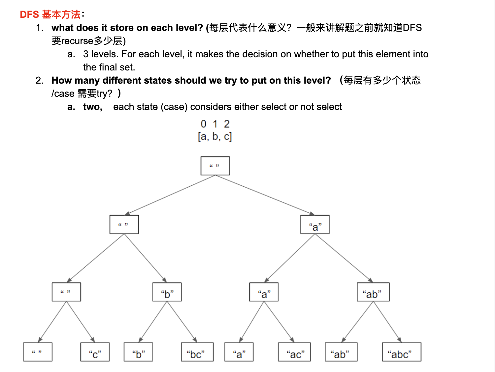
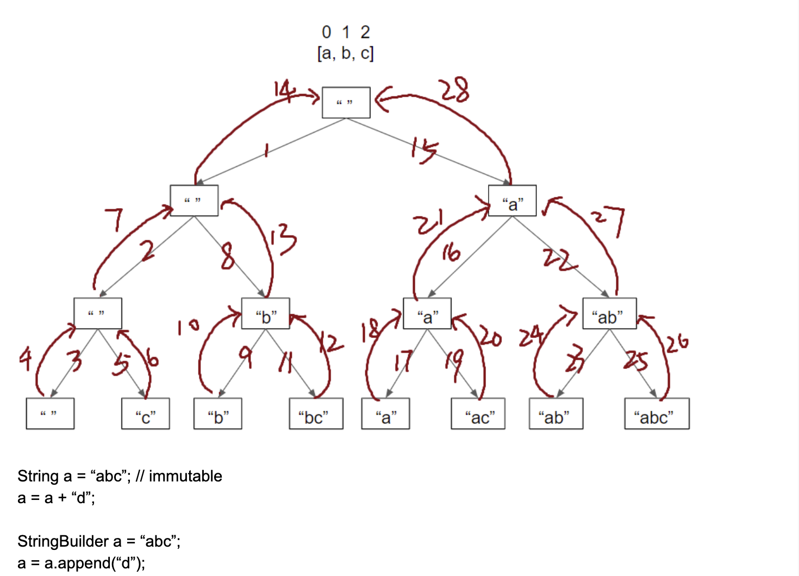
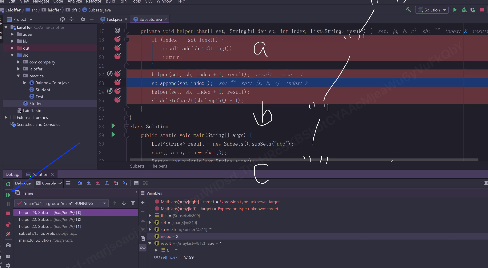
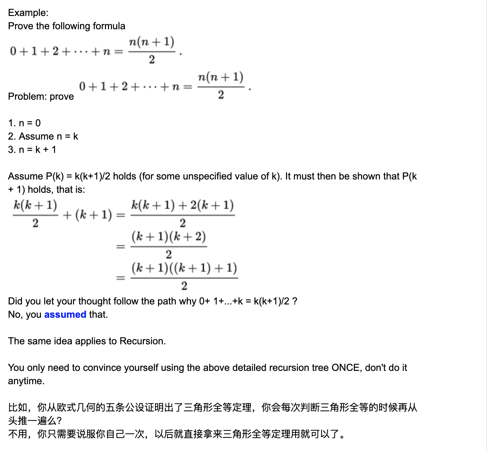

# P12 Review DFS

## Programming against Interface instead of Implementation

- We can use interface insetad of implementation everywhere except in the "new" statements

- Examples:

```java
List<Integer> a = null;          //OK

List<Integer> b = a;          //OK


public void sort(List<Integer> list){...}       //OK


class DataHolder{                               //OK
    private List<Comparable<Integer>> data;
}


lists.add(new List<Integer>());             //wrong


lists.add(new ArrayList<Integer>());             //OK

```

- 接受参数时，最好用Interface，这样更general, 因为可以用作各种数据类型

- List<> 如果不放内容，那么默认放的是Object

---

## 为什么用Interface 来声明?

1. More flexible

2. More extensible


---


## AII subsets

```ruby
Given a set of characters represented by a String, 
return a list containing all subsets of the characters.


Assumptions:
- There are no duplicate characters in the original set.


Examples

Set = "abc", all the subsets are [“”, “a”, “ab”, “abc”, “ac”, “b”, “bc”, “c”]
Set = "", all the subsets are [""]
Set = null, all the subsets are []
```





- Debug:



- 对每一层进行 “加” 与 “不加” 的操作

- 由于binary tree 分成 二叉 => 一定是调用两次递归，(分成几叉就调用几次递归)

- 为什么 吃了🤮？ 因为从child节点回到parent节点的时候，要恢复parent本身的状态，不删除(吃进去的)，
  那就和原来的状态不一样了。

- 递归可以从三个部分考虑： 1. base case 2. 分几个叉根据逻辑，是什么，想尝试的是什么。3. 吃了🤮

- 递归的编写，先不要往下走，重要的是给出正确的assume, 找准关系(一般情况：本层的进入，和离开时候保持一致)

- 0个元素 和 集合为空的区别

- StringBuilder 就相当于ArrayList, 也是动态扩容，所以append() 是 amortized O(1)

- 什么时候需要用 deep Copy?  如果中间状态是mutable =>  那就需要

---

## Recall DFS:  All Subsets I

1. base case 最小不可分割的问题
2. 分几个叉(调用几次recursion call),分叉的逻辑是什么，你究竟想尝试的是什么
3. 吃了🤮

- Time = $$O(2^n * n)$$
- Extra space = $$O(n)$$

---


- When you call a recursive function, don't let your thoughts follow the recursion
  into the deepest level!

- Instead, only look at the logic of the current level, and **assume** the logic of
  the next level is reasonable.

- Why?
  Think about Mathematical Induction(数学归纳法)



#### Look at the Code Again

- Let's use mathematical induction idea to at the code again.

- Question: How to prove the StringBuilder sb reamins unchanged upon entering the 
  helper function and exiting the helper function?


