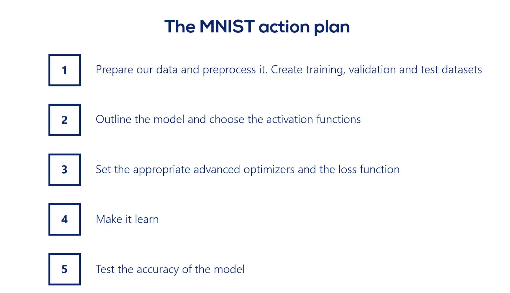

## The dataset

- Our objective is to build an algorithm that takes as input an image and then
  correctly detemines which number is shown in that image




---


```py
# Import the relevant packages
import numpy as np
import tensorflow as tf

import tensorflow_datasets as tfds


# Data
mnist_dataset, mnist_info = tfds.load(name='mnist', with_info=True, as_supervised=True)

mnist_train, mnist_test = mnist_dataset['train'], mnist_dataset['test']

num_validation_samples = 0.1 * mnist_info.splits['train'].num_examples
num_validation_samples = tf.cast(num_validation_samples, tf.int64)

num_test_samples = mnist_info.splits['test'].num_examples
num_test_samples = tf.cast(num_test_samples, tf.int64)


# Normally, we'd like to scale our data in some way to make the result more
# numerically stable (e.g. inputs between 0 and 1)

def scale(image, label):
    image = tf.cast(image, tf.float32)
    image /= 255.
    return image, label

scaled_train_and_validation_data = mnist_train.map(scale)
# dataset.map(function) applies a custom transformation to given
# dataset. It takes as input a function which determines the transformation


test_data = mnist_test.map(scale)


# When we are dealing with enormous dataset, we can't shuffle all data at once
BUFFER_SIZE = 10000

# Shuffling = Keeping the same information but in a different order
shuffled_train_and_validation_data = scaled_train_and_validation_data.shuffle(BUFFER_SIZE)

validation_data = shuffled_train_and_validation_data.take(num_validation_samples)
train_data = shuffled_train_and_validation_data.skip(num_validation_samples)


BATCH_SIZE = 100

train_data = train_data.batch(BATCH_SIZE)
# dataset.batch(batch_szie) , a method that comines the consecutive elements of a 
# dataset into batches

validation_data = validation_data.batch(num_validation_samples)
test_data = test_data.batch(num_test_samples)

validation_inputs, validation_targets = next(iter(validation_data))
# iter(), create an object which can be iterated one element at a time (e.g. in a for loop)
# next(), loads the next element of an iterable object
```


