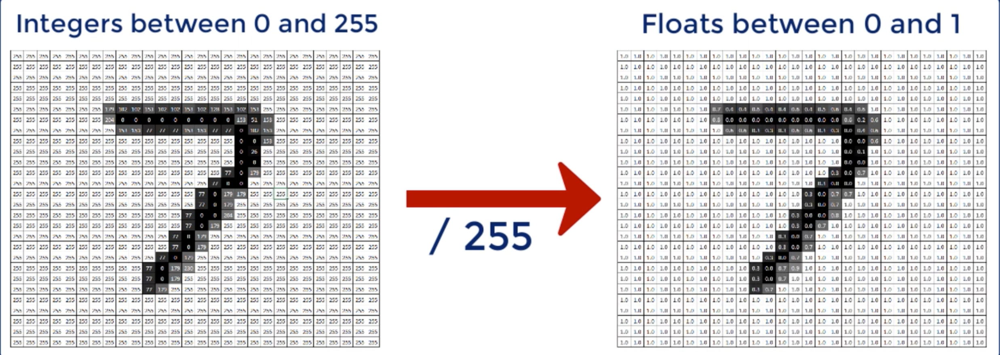

## The dataset

- Our objective is to build an algorithm that takes as input an image and then
  correctly detemines which number is shown in that image


---


```py
# Import the relevant packages
import numpy as np
import tensorflow as tf

import tensorflow_datasets as tfds


```





