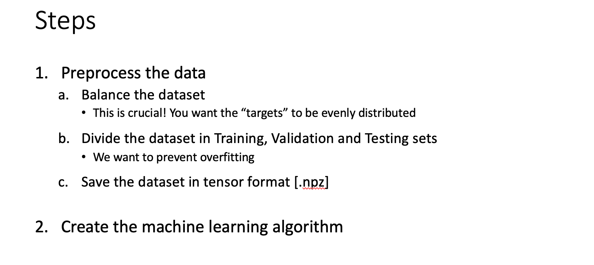
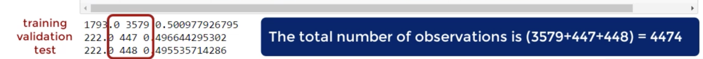

## Exploring the dataset and identifying predictors

- Logically it relates to the audio version of books only each customer in the database
  has made a purchase

- Goal: create a machine learning model that predicts if a customer will buy again from
  the platform


  

- for `audiobooks.csv`, each row represents a person
  - we have customer ID, here ID is like a name, we will skip it on my algorithm
  - we have book length OVERALL, booklengh for average, (sum divided by the number of purchase)
  - The # purchase = overall length / average length
  - The price variable is almost always a good predictor!
  - Review is a Boolean. It shows if the customer left a review (1 = left a review, 0 = didn't)
  - for Review 10/10, it measures the review of a customer from 1 to 10
    - we quickly see most people leave no review, as in most marketplaces
    - for our ML algorithm, 8.91 = status quo a review > 8.91 indicates above average "feelings"
    - a review < 8.91 indicates below average "feelings"
  - Last visited minus Purchase data: if it is 0, indicates the customer has never accessed whe 
    he/she has bought

- We are doing supervised learning so we need `targets`
  - Targets: `1` if a customer bought again in the last 6 months of data, `0` if a customer did 
    not buy again

---

## Outline the business case




---

## Balancing the dataset

- What accuracy do you expect?
  - 90% very good


---

## Preprocessing the data


```py
import numpy as np
from sklearn import preprocessing


raw_csv_data = np.loadtxt('Business_case_dataset.csv', delimiter=',')

unscaled_inputs_all = raw_csv_data[:,1:-1]
# the inputs are all columns in the csv, except for the first one [:, 0]
# (which is just the arbitrary customer IDs that bear no useful information), 
# and the last one [:, -1] (which is our targets)
targets_all = raw_csv_data[:,-1]


# Balancing our data
num_one_targets = int(np.sum(targets_all))
# we count how many targets are 1 (meaning that the customer did buy again)
zero_targets_counter = 0 # set a counter for targets taht are 0 (meaning that the customer didn't buy agian)

# a list
indices_to_remove = [] # we want to create a "balanced" dataset, so we will have to remove
# some input/target pairs, and we declare that will do that, 

for i in range(targets_all.shape[0]):  # we count the number of targest that are 0
    if targets_all[i] ==0:
        zero_targets_counter += 1  # we want to increase 0 counter by 1, if the target is 0
        if zero_targets_counter > num_one_targets: #if the number of 0 is bigger than the num of 1, we want to take note of that index
            indices_to_remove.append(i)

unscaled_inputs_equal_priors = np.delete(unscaled_inputs_all, indices_to_remove, axis = 0)
targets_equal_priors = np.delete (targets_all, indices_to_remove, axis=0)
# we create two new variables, one that will contain the inputs, and one that will contain the targets
# we delete all indices that we marked "to remove" in the loop above


# Standardizing 标准化 the inputs 
# that's the only palce we use sklearn functionality, we will take advantage of its preprocessing capabilities
scaled_inputs = preprocessing.scale(unscaled_inputs_equal_priors)
### At the end of my business case, I can try to run the algorithm WITHOUT this line of code
### the result will be interesting ...


# Shuffle the data

# When the data was collected it was actually arranged by date
# We want to shuffle the indices of the data, so the data is not arranged in any way when we feed it
shuffled_indices = np.arange(scaled_inputs.shape[0]) # np.arange([start], stop), is a method that reuturns a evenly spaced values
np.random.shuffle(shuffled_indices)

shuffled_inputs = scaled_inputs[shuffled_indices]
shuffled_targets = targets_equal_priors[shuffled_indices]


# Splitting the data

samples_count = shuffled_inputs.shape[0]   # we count the total number of samples

# we count the samples in each subset, assuming we want 80-10-10 distribution of training, validation, and test
train_samples_count = int(0.8 * samples_count)
validation_samples_count = int(0.1 * samples_count)

# test_samples_count = samples_count - validation_samples_count - train_samples_count 
test_samples_count = samples_count - train_samples_count - validation_samples_count
# The 'test' dataset contains all remaining data


#we create variables that record the inputs and targets for training
#In our shuffled dataset, they are the first train_samples_count observations
train_inputs = shuffled_inputs[:train_samples_count]
train_targets = shuffled_targets[:train_samples_count]

# We create variables that record the inputs and targets for validation
# They are the next "validation_samples_count" observations, folllowing the "train_samples_count" we already assigned
validation_inputs = shuffled_inputs[train_samples_count:train_samples_count+validation_samples_count]
validation_targets = shuffled_targets[train_samples_count:train_samples_count+validation_samples_count]

# We create variables that record the inputs and targets for test
# They are everything that is remaining
test_inputs = shuffled_inputs[train_samples_count+validation_samples_count:]
test_targets = shuffled_targets[train_samples_count+validation_samples_count:]


# We print the number of targets that are 1s, the total number of samples, 
# and the proportion for training, validation, and test.
#      The output should be close to 50% for all three
print(np.sum(train_targets), train_samples_count, np.sum(train_targets) / train_samples_count)
print(np.sum(validation_targets), validation_samples_count, np.sum(validation_targets) / validation_samples_count)
print(np.sum(test_targets), test_samples_count, np.sum(test_targets) / test_samples_count)


# Saving in .npz format
# Finally, we save the three datasets in *.npz format
np.savez('Audiobooks_data_train', inputs=train_inputs, targets=train_targets)
np.savez('Audiobooks_data_validation', inputs=validation_inputs, targets=validation_targets)
np.savez('Audiobooks_data_test', inputs=test_inputs, targets=test_targets)
```





