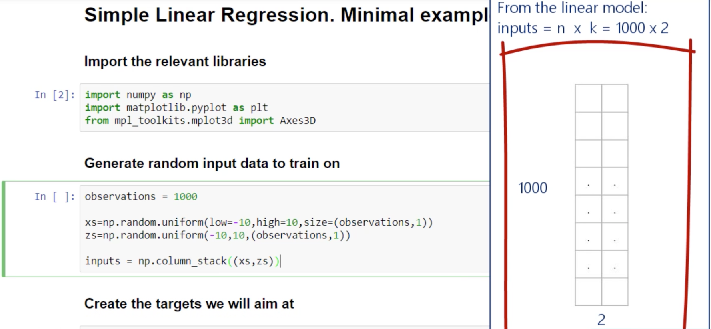
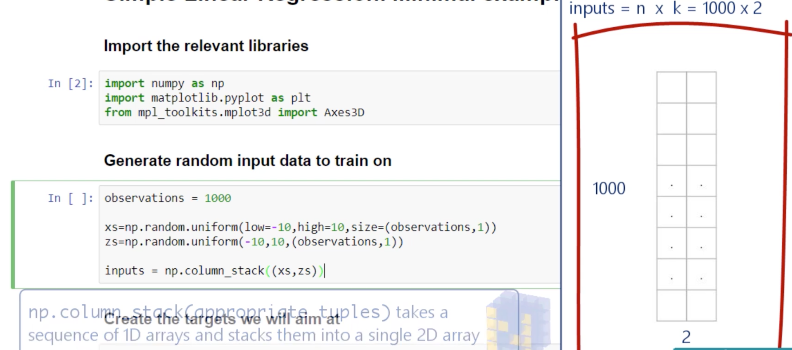
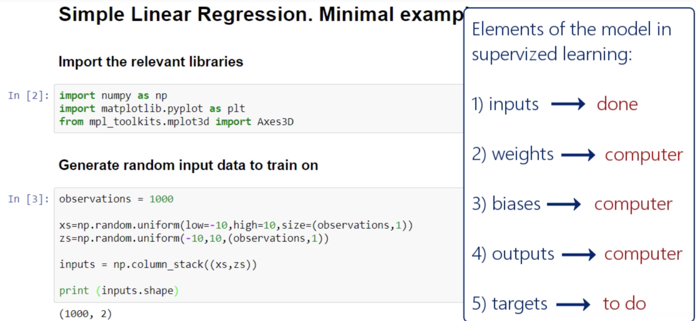
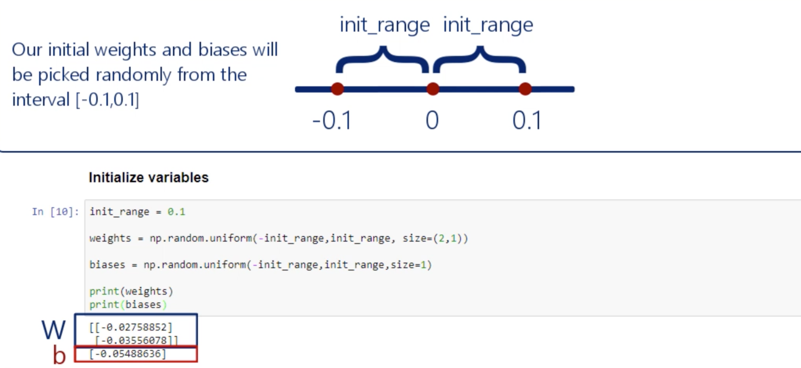
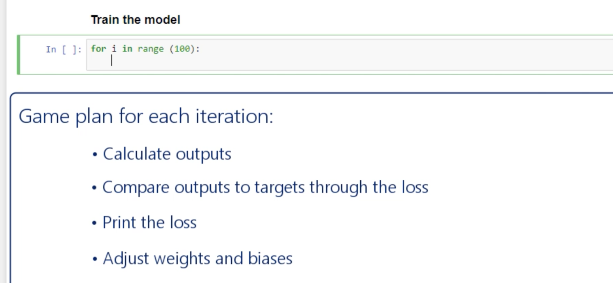
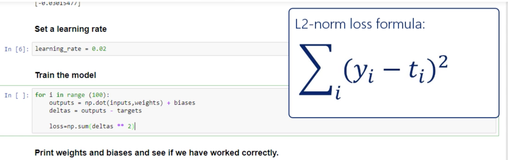

## Minimal example

- Simple Linear Regression,  Minimal example

- 1. Import the relevant libraries:


```py
import numpy as np          # mathematical operations
import matplotlib.pyplot as plt      # nice graphs
from mpl_toolkits.mplot3d import Axes3D  # nice 3D graphs
```


- 2. Generate random input data to train on

```py
observations = 1000

xs = np.random.uniform(low = -10, high = 10, size = (observations, 1))
# np.random.unifor(low, high, size) draw a random value from the interval
# (low, hight), where each number has an equal chance to be selected

zs = np.random.uniform(-10, 10, size = (observations, 1))

inputs = np.column_stack((xs, zs))

print(inputs.shape)
```






- 3. Create the targets we will aim at

```py
# targets = f(x, z) = 2 * x - 3 * z + 5 + noise
# you can try different functions for homework

noise = np.random.uniform(-1, 1, (observations, 1))

targets = 2 * xs - 3 * zs + 5 + noise

print(targets.shape)
```




- 4. Plot the training data

```py
targets = targets.reshape(observations,)
fig = plt.figure()
ax = fig.add_subplot(111, projection='3d')
ax.plot(xs, zs, targets)
ax.set_xlabel('xs')
ax.set_ylabel('zs')
ax.set_zlabel('Targets')
ax.view_init(azim=100)
plt.show()
targets = targets.reshape(observations, 1)


init_range = 0.1

weights = np.random.uniform(-init_range, init_range, size=(2,1))

biases = np.random.uniform(-init_range, init_range, size=1)

print(weights)
print(biases)


learning_rate = 0.02


# Train the model

for i in range(100):
    outputs = np.dot(inputs, weights) + biases
    deltas = outputs - targets
    
    loss = np.sum(deltas ** 2) / 2 / observations
    print(loss)
    
    deltas_scaled = deltas / observations
    
    weights = weights - learning_rate * np.dot(inputs.T, deltas_scaled)
    biases = biases - learning_rate * np.sum(deltas_scaled)


print(weights, biases)
```









