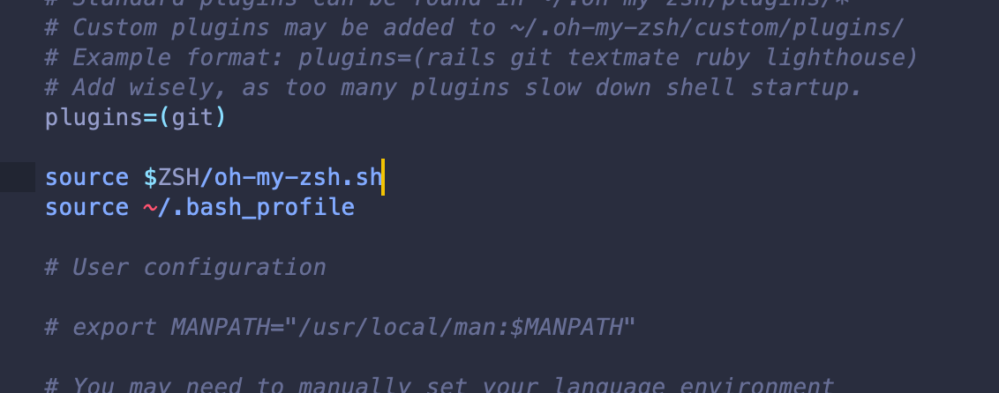

## set Jupyter Notebook env

- [Zsh: Conda/Pip installs command not found](https://stackoverflow.com/questions/31615322/zsh-conda-pip-installs-command-not-found)

```ruby
vim ~/.zshrc

# add

source ~/.bash_profile

# nto .zshrc file
# and then in terminal, enter

source ~/.zshrc
```




```ruby
conda install tensorflow

pip install --upgrade tensorflow

pip install ipykernel
```


---

## Now, close and open again Jupyter to test if everything went right


- Now, it works


## Installing Packages

- Let’s install scikit-learn and the TensorFlow datasets


```ruby
pip install scikit-learn

pip install tensorflow-datasets
```


- Import the relevant libraries

```ruby
pip install matplotlib
```