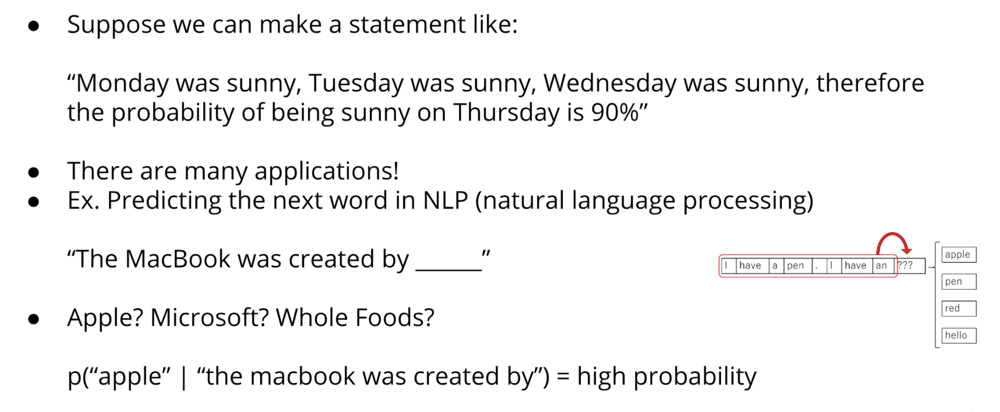
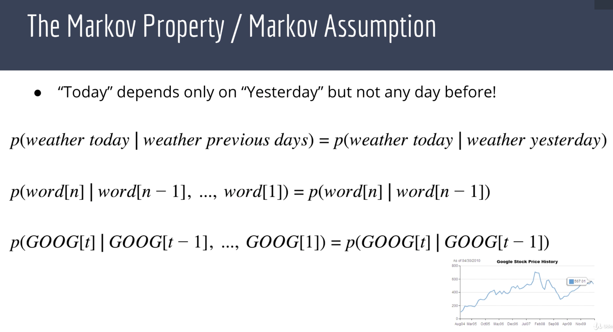
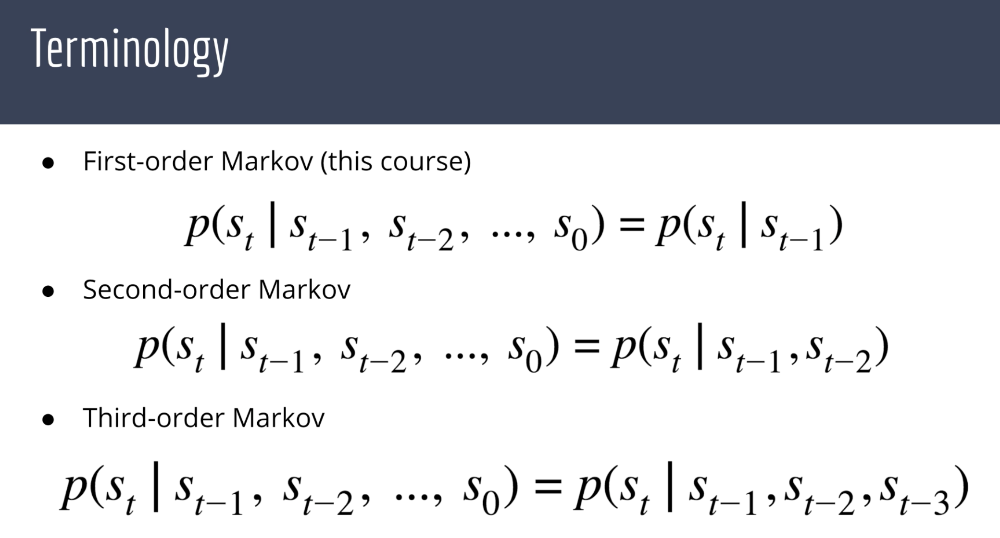
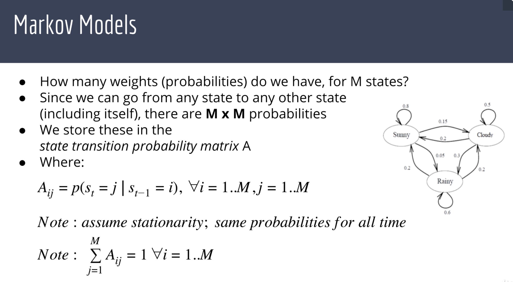
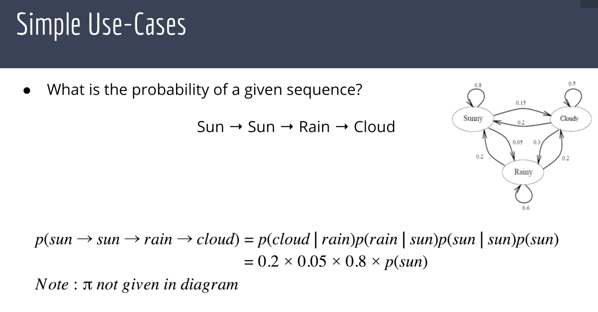
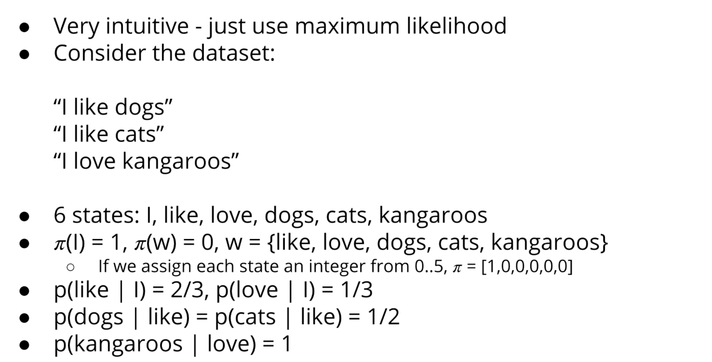

## Making Predictions Based on Previous Values

- The markov property is when tomorrow's weather only depends on today's weather but not yesterday's weather
- It's when the next word in the sentence depends only on the previous word in a sentence but not on any of 
  the other words.
- It's when tomorrow's stock price depends only on today's stock price but not on yesterday's stock price

- so far, we will focus exclusively on first order Markov models

---

## Markov Models

### Training a Markov Model

---

