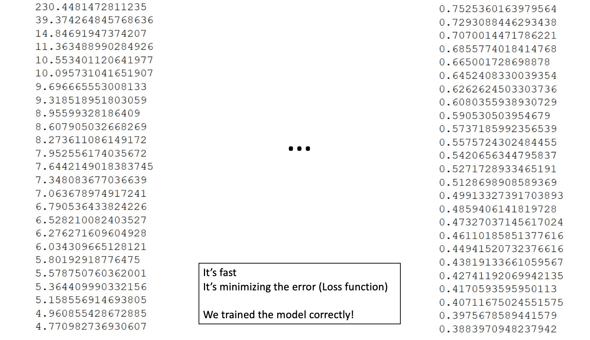
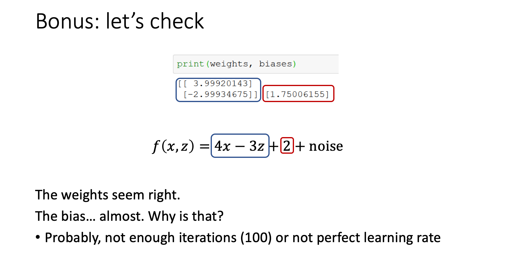
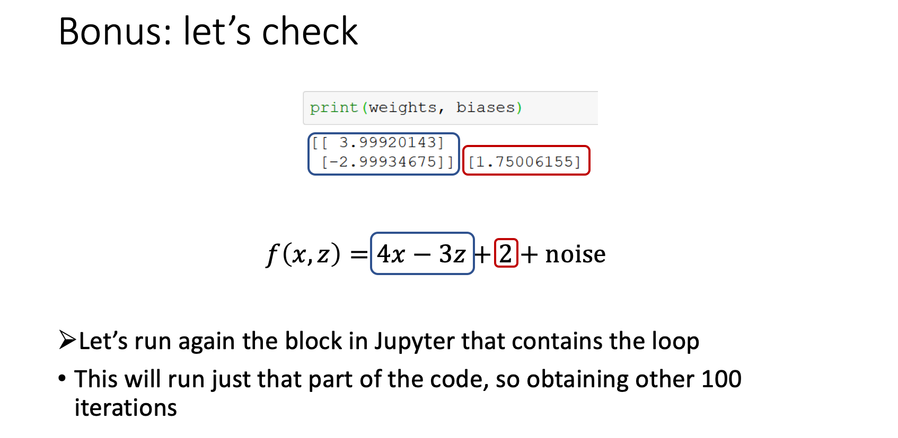
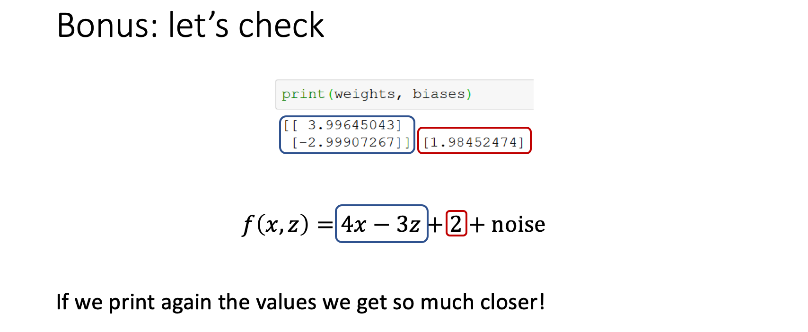

## NumPy

- Numpy is a Linear Algebra Libray for Python, the reason it is so important for Data Science
  with Python is that almost all of the libraries in the PyData Ecosystem rely on NumPy as one
  of their main building blocks
- Numpy has bindings to C libraries.


- NumPy arrays are the main way we will use Numpy throughout the course
- Numpy arrays essentially come in two flavors: vectors and matrices.
- Vectors are strictly 1-d arrays and matrices are 2-d (but you should note a matrix can still
  have one row or one column)

---


### Lecture 4 , exmaple

```python
import numpy as np
import matplotlib.pyplot as plt
from mpl_toolkits.mplot3d import Axes3D

observations_nr = 1000  # We select how many samples/observations we need (observations_nr)
x_values = np.random.uniform(low = -10, high = 10, size = (observations_nr, 1))
z_values = np.random.uniform(low = -10, high = 10, size = (observations_nr, 1))
# We use np.random.uniform to generate these values

inputs = np.column_stack((x_values, z_values)) 
# We use np.column_stack to literally stack two vectors in a matrix

# print(inputs)
```


#### numpy.random.uniform() in Python

- [Syntax](https://www.geeksforgeeks.org/numpy-random-uniform-in-python/)

---

## sample code


```python

import numpy as np
import matplotlib.pyplot as plt
from mpl_toolkits.mplot3d import Axes3D

observations_nr = 1000  # We select how many samples/observations we need (observations_nr)
x_values = np.random.uniform(low = -10, high = 10, size = (observations_nr, 1))
#  size = (observations_nr, 1)  =>  observations_nr is row, 1 is column

z_values = np.random.uniform(low = -10, high = 10, size = (observations_nr, 1))
# We use np.random.uniform to generate these values
# Syntax:  numpy.random.uniform(low=0.0, high=1.0, size=None)

inputs = np.column_stack((x_values, z_values)) 
# We use np.column_stack to literally stack two vectors in a matrix

noise = np.random.uniform(-1,1,(observations_nr,1)) 
# The noise ensures that the data looks more random, In fact, real data always contains noise

targets = 4*x_values - 3*z_values + 2 + noise

boundary_range = 0.1
weights = np.random.uniform(-boundary_range, boundary_range, (2,1))  # w => 2 * 1
biases = np.random.uniform(-boundary_range, boundary_range, 1)       # b => 1 * 1

learning_rate = 0.02

for i in range (100):          
    # We run the algorithm over 100 iterations This is an arbitrary number
    outputs = np.dot(inputs, weights) + biases 
    # We calculate the outputs for the given weights and biases, they are random
    # f(x) = x1 * w1 + x2 * w2 + b
    deltas = outputs - targets
    loss = np.sum(deltas**2) / 2 / observations_nr   # we can divided every constant
#     print(loss)     
# We print the loss because we want to see if it is decreasing Otherwise, we need to change
# the learning rate
    deltas_scaled = deltas / observations_nr
    weights = weights - learning_rate * np.dot(inputs.T, deltas_scaled)
    biases = biases - learning_rate * np.sum(deltas_scaled)
    print(weights, biases)   # this is very close to 4 , -3   +2

```

---



- If you run the previous code, you should see a series of numbers (the output of the Loss function) 
  that decreases constantly Try different 𝜂 values to see what happens.

- NOTE: your output will very likely be different, because different random weights, biases and 
  points would be generated 









