## TensorFlow Introduction

- TensorFlow is a deep learning library, developed by Google, that allows us to create fairly
  complicated models with little coding


```py
import numpy as np
import matplotlib.pyplot as plt
import tensorflow as tf
```

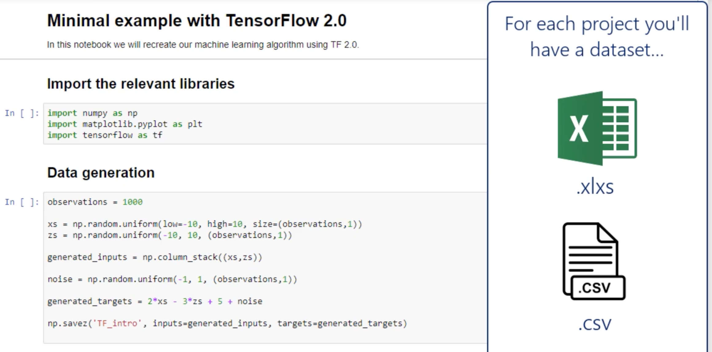

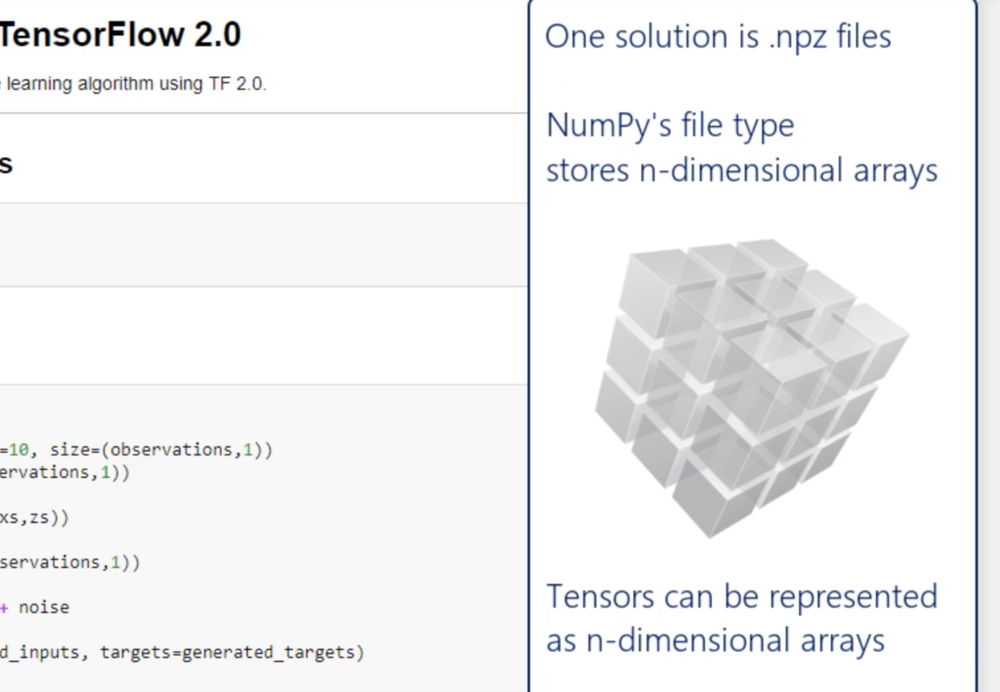


- data -> preprocess -> save in `.npz`


- Data generation

```py
observations = 1000

xs = np.random.uniform(low=-10, high=10, size=(observations,1))
zs = np.random.uniform(-10, 10, (observations,1))

generated_inputs = np.column_stack((xs,zs))

noise = np.random.uniform(-1, 1, (observations,1))

generated_targets = 2*xs - 3*zs + 5 + noise

np.savez('TF_intro', inputs=generated_inputs, targets=generated_targets)
```


- Solving with TensorFlow

```py
training_data = np.load('TF_intro.npz')

input_size = 2
output_size = 1

model = tf.keras.Sequential([
                            tf.keras.layers.Dense(output_size)    
                            ])

# 1. L2-norm loss = Least sum of squares(least sum of squared error)
# 2. Scaling by #observations = average(mean)
model.compile(optimizer='sgd', loss='mean_squared_error')
# SGD = Stochastic Gradient Descent
# When using high-level packages that require a string, you'd want to check what you
model.fit(training_data['inputs'], training_data['targets'], epochs=100, verbose=0)
# Epoch = iteration over the full dataset
```

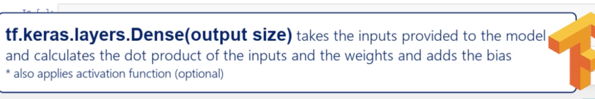

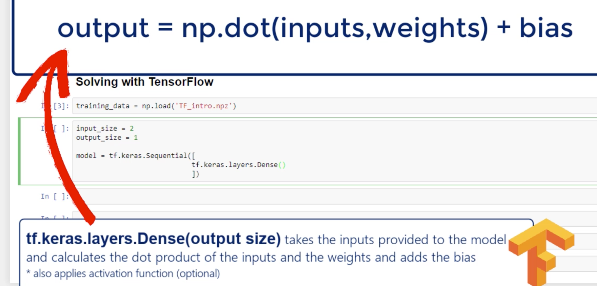

---

### Interpreting the result and extracting the weights and bias

- `varbose = 0`, stands for 'silent' or no output about the training is displayed

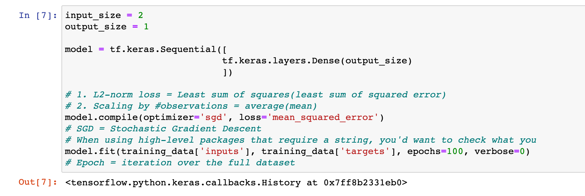

- so we change to `varbose = 1`

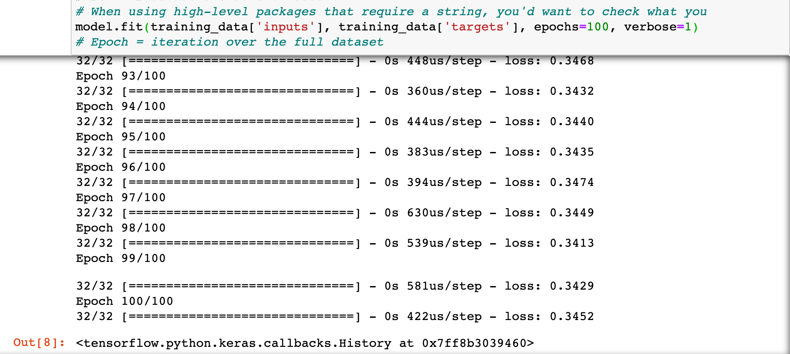

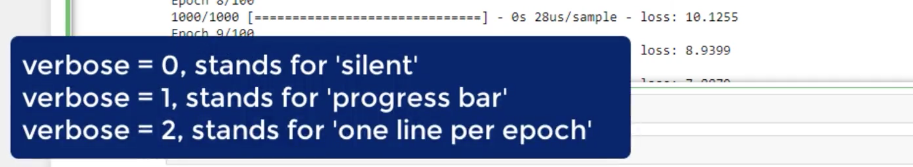

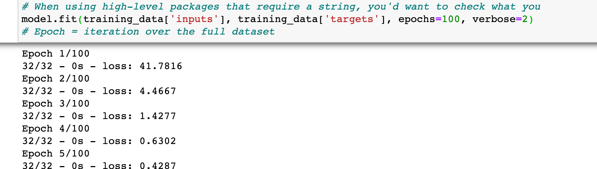

---

### Extract the outputs 

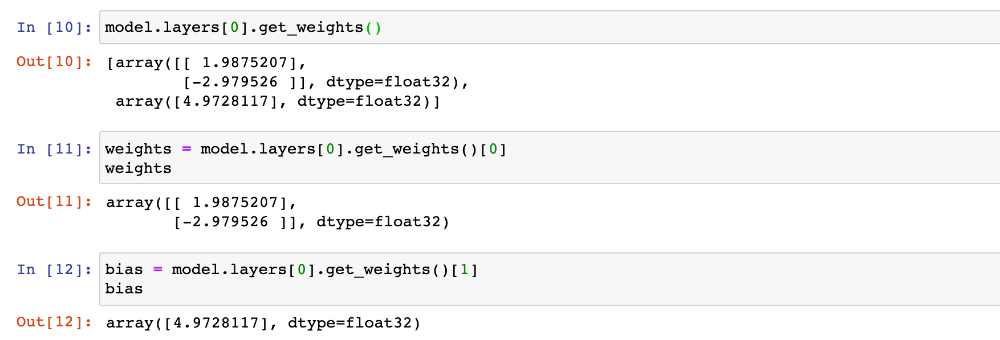


- extract the outputs(make predictions)

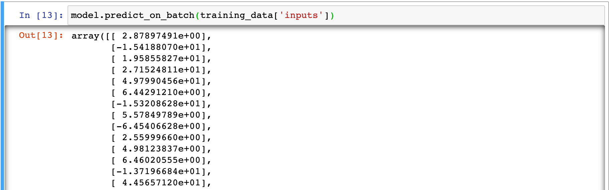

- we can round 1 digit

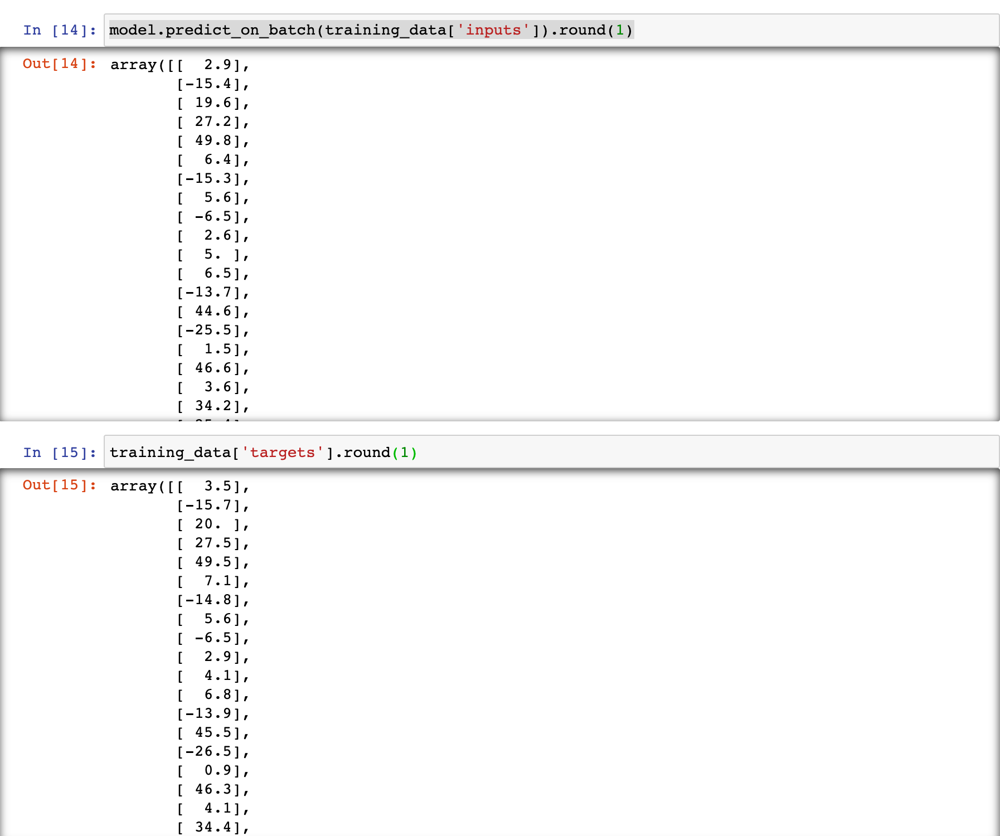


```py
plt.plot(np.squeeze(model.predict_on_batch(training_data['inputs'])), np.squeeze(training_data['targets']))
plt.xlabel('outputs')
plt.ylabel('tragets')
plt.show()
```

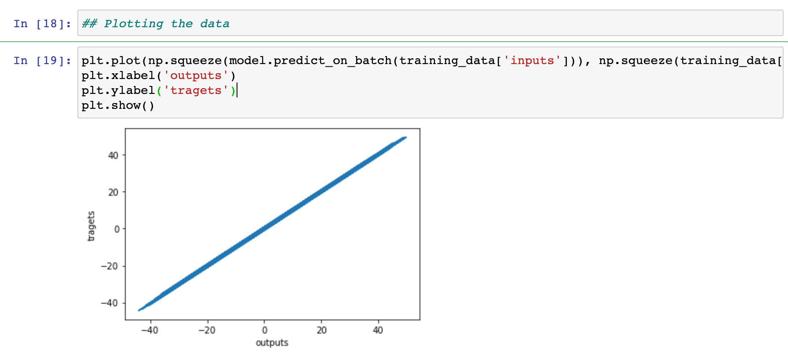
