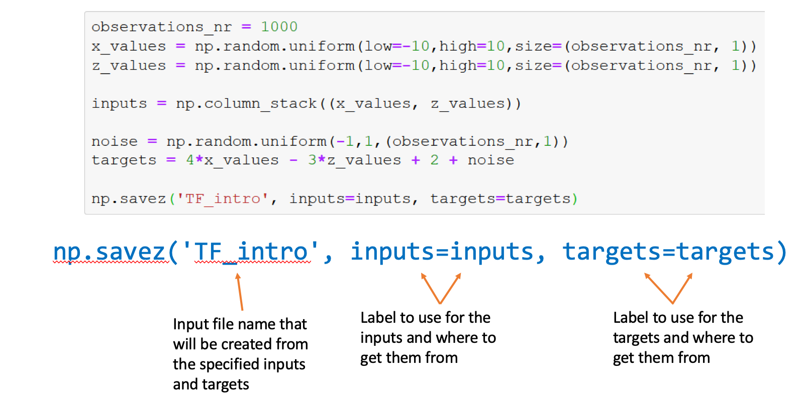
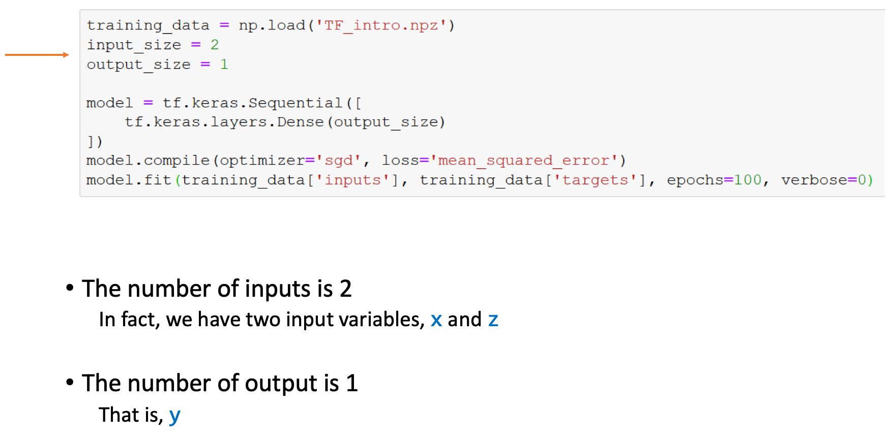
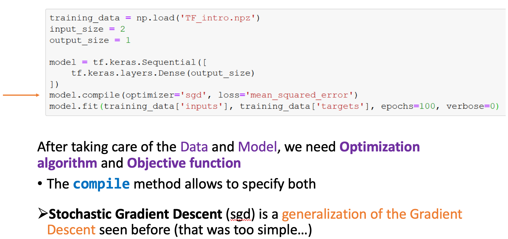
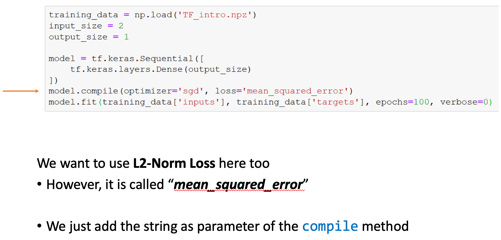
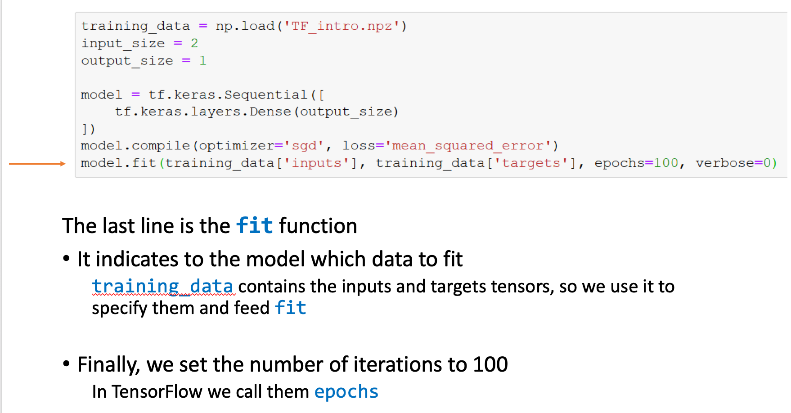
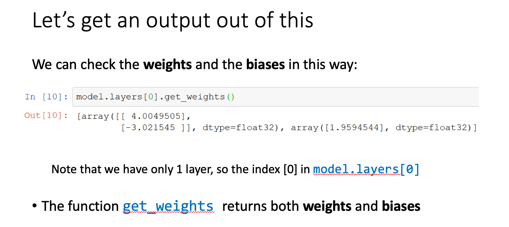
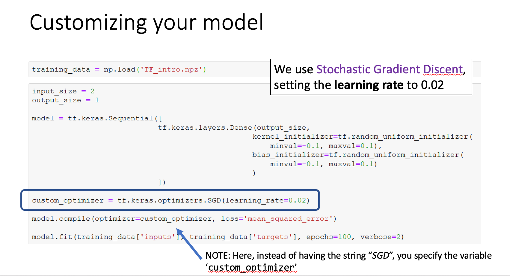

## TensorFlow

- First, we need to understand the dimensionality of a tensor n. [数] 张量；


#### TensorFlow coding

```python
import numpy as np
import matplotlib.pyplot as plt
import tensorflow as tf

observations = 1000

xs = np.random.uniform(low=-10, high=10, size=(observations,1))
zs = np.random.uniform(-10, 10, (observations,1))

generated_inputs = np.column_stack((xs,zs))

noise = np.random.uniform(-1, 1, (observations,1))

generated_targets = 2*xs - 3*zs + 5 + noise

np.savez('TF_intro', inputs=generated_inputs, targets=generated_targets)
```


- TensorFlow doesn’t work well with data stored in classic .csv or .xlxs files 
  It likes to work with tensors (and it makes certainly sense)

- The extension that TF2 likes is `.npz`
  - This is a NumPy’s file type used to store n-dimensional arrays
  - we need to preprocess data so to become an .npz file type,
    - `np.savez` does just that




---

### Let's train the model



- we have `x` value and `z` value



- [There are several optimizer that you can use:](https://www.tensorflow.org/api_docs/python/tf/keras/optimizers)









- we can set different learning rate


