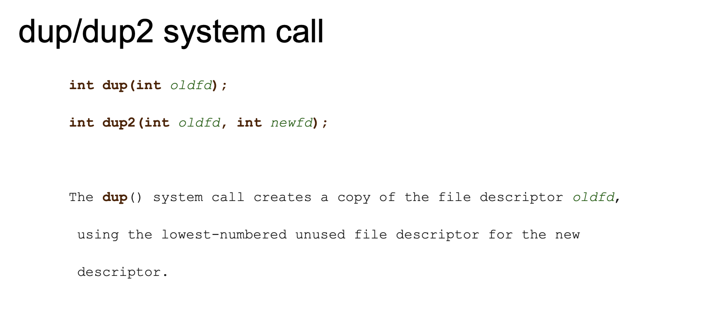
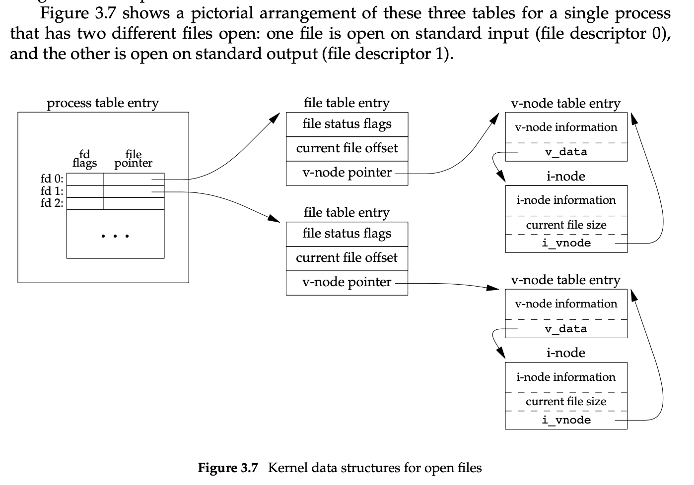
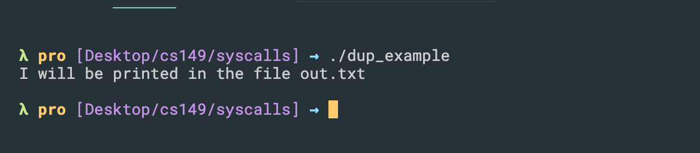
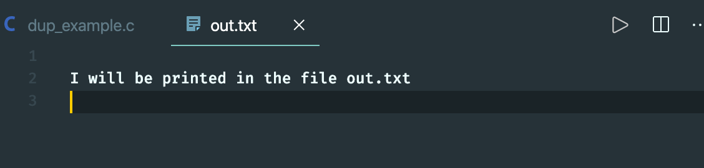
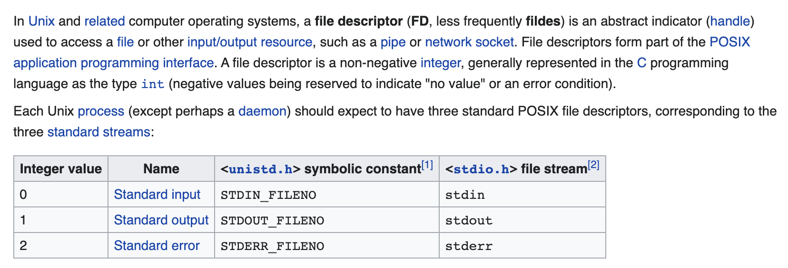

# dup()/dup()2




- file descriptor 0 , means standard input
- file descriptor 1 , means standard output

### dup/dup2 system call
```c++
int dup(int oldfd);
int dup2(int oldfd, int newfd);


The dup() system call creates a copy of the file descriptor oldfd, 
using the lowest-numbered unused file descriptor for the new descriptor. 
```

#### example:

```c
// program to illustrate dup2() 
#include<stdlib.h> 
#include<unistd.h> 
#include<stdio.h> 
#include<fcntl.h> 
int main() 
{ 
	int file_desc = open("out.txt",O_WRONLY | O_APPEND); 
	// here the newfd is the file descriptor of stdout (i.e. 1) 

	dup2(file_desc, 0) ; //set newfd 0, means standard input

	// All the printf statements will be written in the file 
	// "out.txt" 
	printf("I will be printed in the file out.txt\n"); 
	
return 0; 
} 
```

- if change `newfd` to 0, standard input, 将会打印在console



- if change `newfd` to 1, standard input, 将会打印在 out.txt

```c
int main() 
{ 
	int file_desc = open("out.txt",O_WRONLY | O_APPEND); 
	// here the newfd is the file descriptor of stdout (i.e. 1) 

	dup2(file_desc, 1) ; //set newfd 0, means standard output

	// All the printf statements will be written in the file 
	// "out.txt" 
	printf("I will be printed in the file out.txt\n"); 
	
return 0; 
} 
```



---

## File descriptor:



