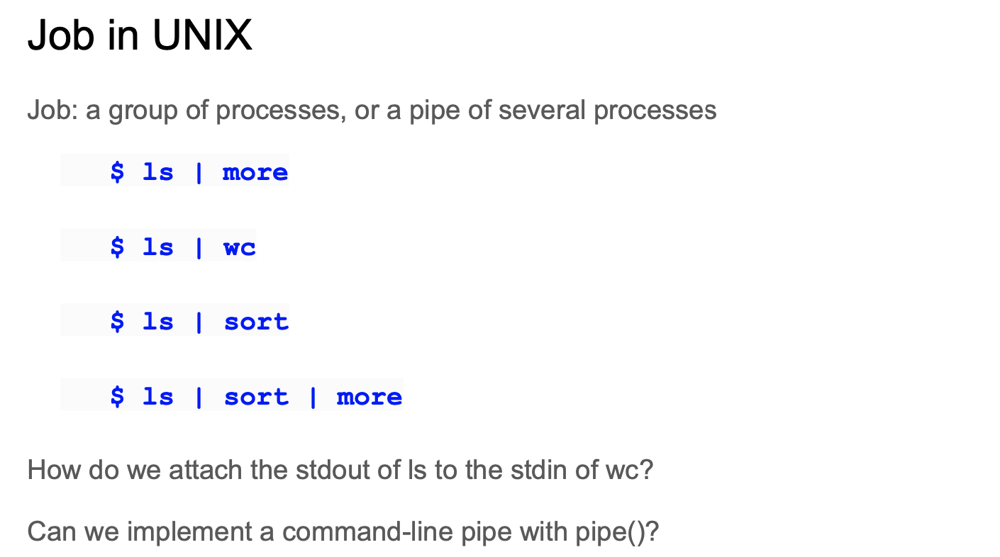
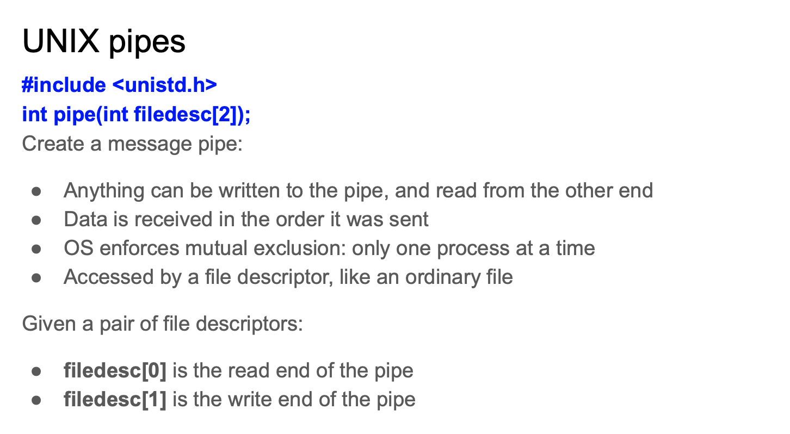
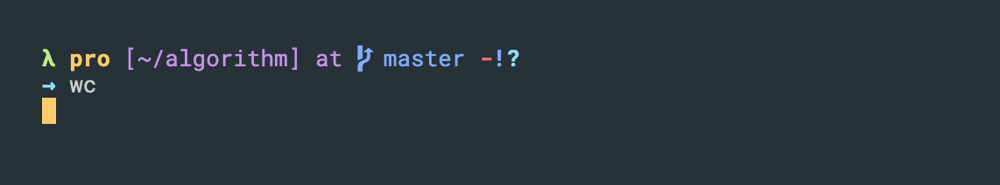
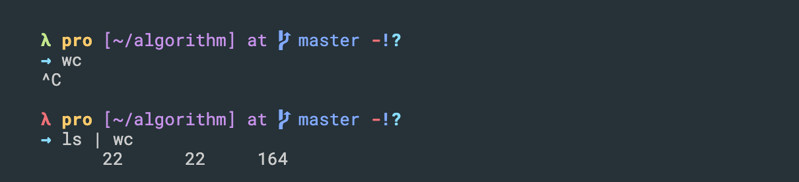
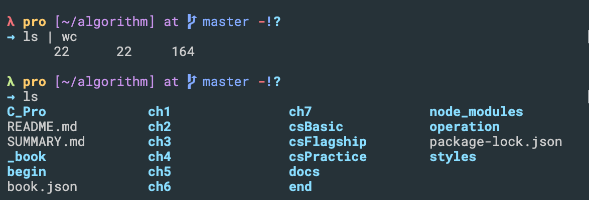
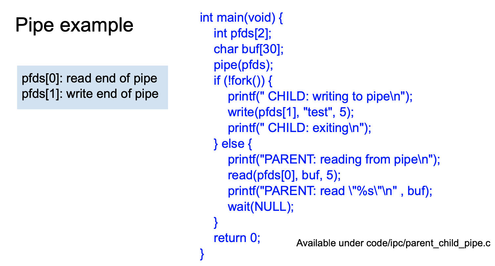

# pipe

- `Pipes` can be used only between processes that have a common `ancestor`. 
  Normally, a `pipe` is created by a `process`, that process calls `fork`, 
  and the `pipe` is used between the `parent` and the `child`.



- To make a `pipe`, put a `vertical bar ()` on the command line between two 
  commands. When a program takes its input from another program, it performs some operation on that input, and writes the result to the `standard output`. It is referred to as a filter.



---

- for example:


- see, you cannot word count



- `words, lines, characters`
  
- `ls | wc`, it works, since `int pipe(int filedesc[2])`:
  - `filedesc[0]` is the read end of the pipe
  - `filedesc[1]` is the write end of the pipe
- the way that this is implemented in `UNIX` is that the first command is 
  `write` end and the second is the `read` end
- 这里简单来说，`UNIX`的哲学，肯定是第一个command是 `write`, 假设如果是 `read` 先来，
  那每次命令行 都得等第二个command 输入

 ---

 - Now look at an example



```c
#include<stdio.h>
#include<stdlib.h>
#include<unistd.h>
#include<sys/types.h>
#include<string.h>
#include<sys/wait.h>

int main(void) { 
    int pfds[2]; 
    char buf[30];  
    pipe(pfds);  
    if (!fork()) { 
        printf(" CHILD: writing to pipe\n"); 
        write(pfds[1], "test", 5); 
        printf(" CHILD: exiting\n");
    } else { 
        printf("PARENT: reading from pipe\n"); 
        read(pfds[0], buf, 5); 
        printf("PARENT: read \"%s\"\n" , buf); 
        wait(NULL); 
    }  
    return 0; 
}

/* 
PARENT: reading from pipe
 CHILD: writing to pipe
 CHILD: exiting
PARENT: read "test"
 */
```


- another example:

```c
// C program to demonstrate use of fork() and pipe()
#include<stdio.h>
#include<stdlib.h>
#include<unistd.h>
#include<sys/types.h>
#include<string.h>
#include<sys/wait.h>
int main(void) {
    int pfds[2];
    double buf[2];

    pipe(pfds);

    if (!fork()) {
        printf(" CHILD: writing to pipe\n");
        buf[0] = 10.12;
        buf[1] = 23.45;
        write(pfds[1], buf, sizeof(buf));
 
        printf(" CHILD: exiting\n");
    } else {
 
        printf("PARENT: reading from pipe\n");
 
        read(pfds[0], buf, sizeof(buf));
 
    	double sum = buf[0] + buf[1];

        printf("PARENT: read \"%f\"\n" , buf[0]);
        printf("PARENT: read \"%f\"\n" , buf[1]);
	    printf("PARENT: sum \"%f\"\n" , sum);
        wait(NULL);
    }
    return 0;
}
```

```ruby
PARENT: reading from pipe
 CHILD: writing to pipe
 CHILD: exiting
PARENT: read "10.120000"
PARENT: read "23.450000"
PARENT: sum "33.570000"
```

- Recall: 
  - `filedesc[0]` is the read end of the pipe
  - `filedesc[1]` is the write end of the pipe

- define a array `int pfds[2]`, represents `filedesc[0], read` 
  and `filedesc[1], write`
- `if (!fork())` is equal to `if(fork() == 0)`
- call `pipe(pfds)`, 建立pipe 通信
- `write(pfds[1], buf, sizeof(buf))`, 从 buf array 读取 `sizeof(buf)`的数据, 
  从pipe end 写进
- `read(pfds[0], buf, sizeof(buf))`, 从 buf array 读取出`sizeof(buf)`数据,
  从pipe end 读取  

