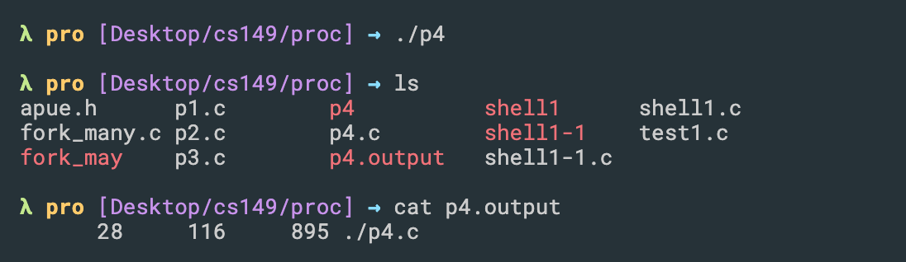

# read write |open() | lseek | redirection | standard output

- open() function
  - O_RDONLY   :   Open for reading only.
  - O_WDONLY   :   Open for writing only.
  - O_RDWR     :   Open for reading and writing 
  - O_APPEND   :   Append to the end of file on each write.
  - O_CREATE   :   Create the file if it doesn't exist.
  - O_TRUNC    :   If the file exists and if it is successfully opened for either write-only 
    or read–write, truncate its length to 0. In other word, delete any content that is already 
    there. If the file already exits.

---

- What does `O_TRUNC` do?
  - If the file already exists and is a regular file and the open mode allows writing 
    (i.e., is `O_RDWR` or `O_WRONLY`) it will be truncated to length 0. 
  - 简单来说，open a file which overwrite existing content

### standard ouput

```cpp
#include <stdio.h>
#include <stdlib.h>
#include <unistd.h>
#include <string.h>
#include <fcntl.h>
#include <sys/wait.h>

int main(int argc, char *argv[]){
    int rc = fork();
    if (rc < 0) { 	// fork failed; exit
        fprintf(stderr, "fork failed\n");
        exit(1);
    } else if (rc == 0) { // child: redirect standard output to a file
        open("./p4.output", O_CREAT|O_WRONLY|O_TRUNC, S_IRWXU);
        //O_CREATE : Create the file if it doesn’t exist.
        // now exec "wc"...
        char *myargs[3];
        myargs[0] = strdup("wc"); 		// program: "wc" (word count)
        myargs[1] = strdup("./p4.c"); 	// argument: file to count
        myargs[2] = NULL; 		// marks end of array
        execvp(myargs[0], myargs); 	// runs word count
    } else { 			// parent goes down this path (main)
        int wc = wait(NULL);
    }
    return 0;
}
```

- in standard output, the result will show on console


- if we call `close(STDOUT_FILENO);`, see what happen, it obviously dosn't show on terminal
  it print the result >> p4.output

```c
int main(int argc, char *argv[]){
    int rc = fork();
    if (rc < 0) { 	// fork failed; exit
        fprintf(stderr, "fork failed\n");
        exit(1);
    } else if (rc == 0) { // child: redirect standard output to a file
        close(STDOUT_FILENO); // close the standard output
        open("./p4.output", O_CREAT|O_WRONLY|O_TRUNC, S_IRWXU);
        //O_CREATE : Create the file if it doesn’t exist.
        // now exec "wc"...
        char *myargs[3];
        myargs[0] = strdup("wc"); 		// program: "wc" (word count)
        myargs[1] = strdup("./p4.c"); 	// argument: file to count
        myargs[2] = NULL; 		// marks end of array
        execvp(myargs[0], myargs); 	// runs word count
    } else { 			// parent goes down this path (main)
        int wc = wait(NULL);
    }
    return 0;
}
```



---

## read() && write()
- `ssize_t read(int fildes, void *buf, size_t nbyte);`
  - The `read()` function shall attempt to read nbyte bytes from the file associated with 
    the open file descriptor, fildes, `into` the buffer pointed to by buf. 
  - **Return value**: Upon successful completion, read() and pread() shall return a non-negative integer 
    indicating the number of bytes actually read. Otherwise, the functions shall return -1 and 
    set errno to indicate the error.

- `ssize_t write(int fd, const void *buf, size_t count);`
  - `write()` writes up to `count` bytes from the buffer pointed `buf` to the file 
    referred to by the file descriptor `fd`.
  - **Return value**: On success, the number of bytes written is returned 
    (zero indicates nothing was written). On error, -1 is returned, and errno is set appropriately.

---
- example:

- start.txt

```
abcdefghijklmnopqrstuvwxyzABCDEFGHIJKLMNOPQRSTUVWXYZ
```

```cpp
void func(char arr[], int n)
{
    // Open the file for READ only.
    int f_read = open("start.txt", O_RDONLY);
    // int f_read = open("1.txt", O_RDONLY);

    // Open the file for WRITE and READ only.
    int f_write = open("end.txt", O_WRONLY);

    int count = 0;
    while (read(f_read, arr, 2))
    {
        printf("read one char from start.txt through arr[0] is: %c, %c\n", arr[0], arr[1]);
        // to write the 1st byte of the input file in
        // the output file
        if (count < n)
        {
            // SEEK_CUR specifies that
            // the offset provided is relative to the
            // current file position
            lseek (f_read, n, SEEK_CUR);
            write (f_write, arr, 1);
            // printf("write one char into end.txt throguh arr[0] is: %c\n", arr[0]);
            count = n;
        }

            // After the nth byte (now taking the alternate
            // nth byte)
        else
        {
            count = (2*n);
            lseek(f_read, count, SEEK_CUR);
            write(f_write, arr, 1);
            // printf("write one char into end.txt throguh arr[0] is: %c\n", arr[0]);
        }
    }
    close(f_write);
    close(f_read);
}

/* 
read one char from start.txt through arr[0] is: a, b
read one char from start.txt through arr[0] is: h, i
read one char from start.txt through arr[0] is: t, u
read one char from start.txt through arr[0] is: F, G
read one char from start.txt through arr[0] is: R, S
 */
```

- `read(f_read, arr, 2)`,  read two bytes from `start.txt` into `char arrary[]`, => `arr[0], arr[1]`
- ` write(f_write, arr, 1);`,  write one byte from `char array[]` into `end.txt`,  
  - `arr[0]` => `end.txt`

---
## lseek() : system call

```cpp
// C program to read nth byte of a file and
// copy it to another file using lseek

#include <stdio.h>
#include <unistd.h>
#include <sys/types.h>
#include <fcntl.h>

void func(char arr[], int n)
{
    // Open the file for READ only.
    int f_read = open("start.txt", O_RDONLY);

    // Open the file for WRITE and READ only.
    int f_write = open("end.txt", O_WRONLY);

    int count = 0;
    while (read(f_read, arr, 1))
    {
        // to write the 1st byte of the input file in
        // the output file
        if (count < n)
        {
            // SEEK_CUR specifies that
            // the offset provided is relative to the
            // current file position
            lseek (f_read, n, SEEK_CUR);
            write (f_write, arr, 1);
            count = n;
        }

            // After the nth byte (now taking the alternate
            // nth byte)
        else
        {
            count = (2*n);
            lseek(f_read, count, SEEK_CUR);
            write(f_write, arr, 1);
        }
    }
    close(f_write);
    close(f_read);
}

// Driver code
int main()
{
    char arr[100];
    int n;
    n = 5;

    // Calling for the function
    func(arr, n);
    return 0;
}

```

- start.txt

```
abcdefghijklmnopqrstuvwxyzABCDEFGHIJKLMNOPQRSTUVWXYZ
```

- for this program, how does lseek() work?
  - `while (read(f_read, arr, 1))`, is true, since it read from `start.txt` one byte into `char arr[]`
  - then `count == 0 < 5`, after `lseek (f_read, n, SEEK_CUR)`, position from 
    `SEEK_CUR` (Current position of the file pointer), + n, 第一个位置 + 5 => 6
  - `write (f_write, arr, 1)`, write one byte from `arr[]`, into `end.txt`

---


### open()

- The `open()` system call opens the file specified by pathname. If the specified file does not exist, 
  it may optionally (if O_CREAT is specified in flags) be created by `open()`.


