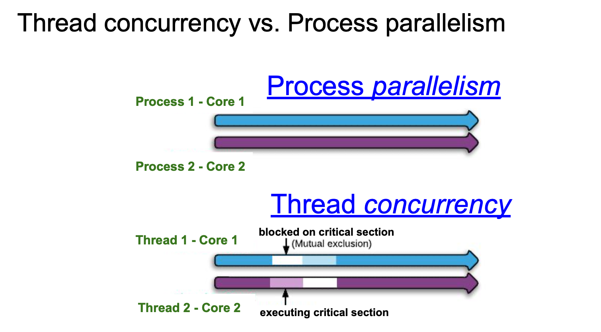

## Concurrency, Thread Interface(API), Locks

#### Thread VS Process

- Usually, a process has only one thread of control:
  - one set of machine instructions executing at a time
- Some problems are easier to solve when >1 thread of control 
  can operate on different parts of the problem.
  - Example: read a very large file in blocks, 1 thread per block
- Additionally, multiple threads of control can exploit the parallelism 
  possible on multiprocessor systems.
- All threads within a process share the same address space and file descriptors.

- Each thread executes on its own stack in the same process.
- Challenge: Because they can access the same memory, the threads need to 
  synchronize access to shared data among themselves to avoid inconsistencies.
 
---

## Threads and Thread IDs

- Like processes, threads are identified by IDs.
- Thread IDs, however, are local to a process.
- A thread ID from one process has no meaning in another process
- We use thread IDs to refer to specific threads as we manipulate the threads
  within a process.
 
---

## What is a thread

- A new abstraction for <u>a single running process</u>
  - Threads were added to the UNIX System long after the 
    process model was established

- Multi-threaded program
  - A multi-threaded program has more than one point of execution
  - Multiple PCs (Program Counter)
  - They share the same `address space`.

## Threads Context Switch
- Each thread has its own `program counter` and `set of registers`
  - **Thread control blocks(TCBs)** store the state of each thread

- When switching from running one (T1) to running the other (T2)
  - The register state of T1 be saved
  - The register state of T2 restored
  - The address space remains the same.
 
---

#### There will be one stack per thread

- both the `program counter` and `stack` don't get shared between threads.

---

## Critical Section (临界区)

- A piece of code that accesses a shared variable and must not be 
  concurrently executed by more than one thread.
  - Need to support atomicity for critical sections (mutual exclusion)
  - Multiple threads executing critical section can result in a 
    race condition(竞争条件):
    - Two or more operations are done at the same time, but they needed 
      to be done sequentially to give the correct result
 
---

## Locks

- Ensure that any such critical section(临界区) executes as if it were a single
  atomic instruction (execute a series of instructions atomically).
 

-  Multi-Threaded programs run faster on multi-processors or many cores

