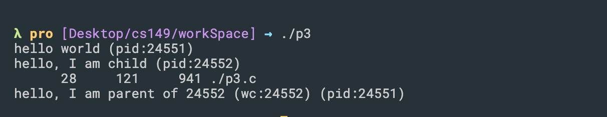
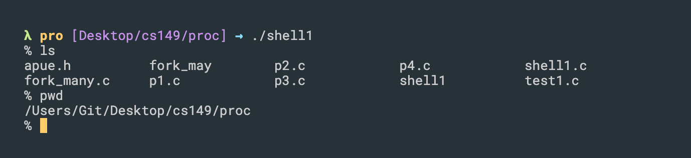
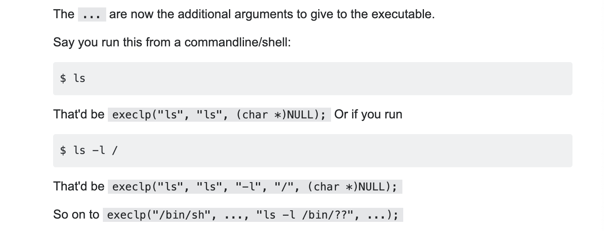
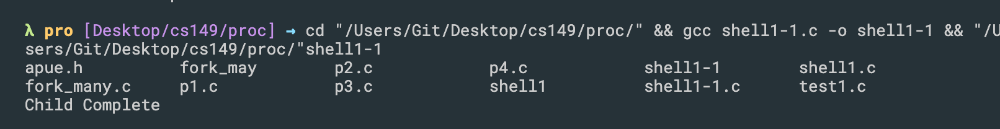
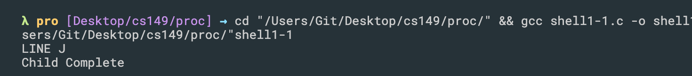
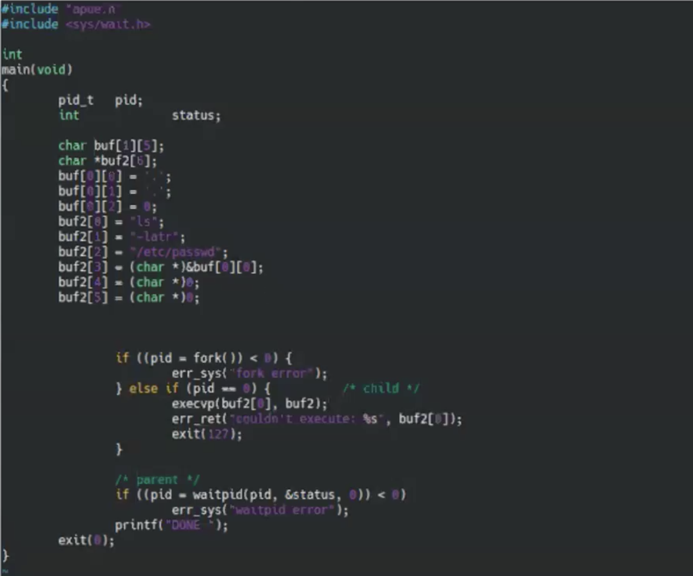

## wait()

- This `wait()` system call won’t return until the child has run and exited

- `wait()`, `waitpid()` can 
  - Block, if all of its children are still running
  - Return immediately with the termination status of a child, 
    if a child has terminated and is waiting for its termination status to be fetched
  - Return immediately with an error, if it doesn’t have any child processes

- The differences between these two functions are as follows:
  - The `wait` function can block the caller until a child process terminates, whereas
    waitpid has an option that prevents it from blocking.
  - The `waitpid` function doesn’t wait for the child that terminates first; it has a
    number of options that control which process it waits for.


- `WIFEXITED(status)` : True if status was returned for a child that terminated normally. 
  In this case, we can execute
  - to fetch the signal number that caused the termination.
  - Additionally, some implementations (but not the Single UNIX Specification) 
    define the macro

---


## exec()

- The `exec()` family of functions replaces the current process image with a new process image
  - When a process calls one of the exec functions, that process is completely replaced by
    the new program, and the new program starts executing at its main function.
  - The process ID does not change across an `exec`, because a new process is not created;
    `exec` merely replaces the current process—its text, data, heap, and stack segments—with a brand-new program from disk.
    - `execvp` passes parameters in array
    - `execlp` passes list of parameters

- now looking at the following example:

```cpp
#include <stdio.h>
#include <stdlib.h>
#include <unistd.h>
#include <string.h>
#include <sys/wait.h>

int main(int argc, char *argv[]){
    printf("hello world (pid:%d)\n", (int) getpid());
    int rc = fork();
    if (rc < 0) { 		// fork failed; exit
        fprintf(stderr, "fork failed\n");
        exit(1);
    } else if (rc == 0) { 	// child (new process)
        printf("hello, I am child (pid:%d)\n", (int) getpid());
        char *myargs[3];
        myargs[0] = strdup("wc"); 		// program: "wc" (word count)
        myargs[1] = strdup("./p3.c"); 	// argument: file to count
        myargs[2] = NULL; 		// marks end of array

        // execvp(myargs[0], myargs); // runs word count 
        // we don't use exec() function see what happen
        printf("this shouldn’t print out\n");
    } else { 			// parent goes down this path (main)
        int wc = wait(NULL);
        printf("hello, I am parent of %d (wc:%d) (pid:%d)\n",
               rc, wc, (int) getpid());
    }
    return 0;
}
```

- result:

```js
hello world (pid:22833)
hello, I am child (pid:22834)
this shouldn’t print out // YOU SEE this line, because child process doesn't run `exec()`,  
                         //it still run old and original program
hello, I am parent of 22834 (wc:22834) (pid:22833)
```

- you can see it didn't run `wc` (word count) program, why?

- Recall: This system call `exec()` is useful when you want to run a program
  that is different from the calling program. For example, calling fork() in `p2.c` is only 
  useful if you want to keep running copies of the `same program`. However, often you want 
  to run a `different program`; `exec()` does just that:
  - in this example, the child process calls execvp() in order to run the program wc, 
    which is the word counting program. 
  - this time, by calling `execvp()`, child process never run old original program, it 
    runs itself program.

```cpp
int main(int argc, char *argv[]){
    printf("hello world (pid:%d)\n", (int) getpid());
    int rc = fork();
    if (rc < 0) { 		// fork failed; exit
        fprintf(stderr, "fork failed\n");
        exit(1);
    } else if (rc == 0) { 	// child (new process)
        printf("hello, I am child (pid:%d)\n", (int) getpid());
        char *myargs[3];
        myargs[0] = strdup("wc"); 		// program: "wc" (word count)
        myargs[1] = strdup("./p3.c"); 	// argument: file to count
        myargs[2] = NULL; 		// marks end of array

        execvp(myargs[0], myargs); // runs word count
        printf("this shouldn’t print out\n");
    } else { 			// parent goes down this path (main)
        int wc = wait(NULL);
        //`wc` (word count) It is used to find out number of lines, word count, byte and
        //characters count in the files specified in the file arguments.
        printf("hello, I am parent of %d (wc:%d) (pid:%d)\n",
               rc, wc, (int) getpid());
    }
    return 0;
}

/* 
hello world (pid:23116)
hello, I am child (pid:23117)
      28     121     941 ./p3.c
hello, I am parent of 23117 (wc:23117) (pid:23116)
 */
```

- Note: `int execvp (const char *file, char *const argv[]);`
  - `execvp` : Using this command, the created child process does not have to run the same
     program as the parent process does. The exec type system calls allow a process to 
     run any program files, which include a binary executable or a shell script 
  - `file`: points to the file name associated with the file being executed.
  - `argv`:  is a null terminated array of character pointers.


## Unix Command Line Interface (file)
- It bears repeating that everything in `Unix` is a `file`. A program is a `file`. To execute a
  program from the `command line`, simply type the name of its `file` at the `prompt`. 
  For example, the ls `command` is a `file`, named `ls` .


- That means you can run `wc p3.c` on terminal:




---


## how to use `execlp()`

```cpp
#include "apue.h"
#include <stdio.h>
#include <stdlib.h>
#include <unistd.h>
#include <string.h>
#include <sys/wait.h>

int main(void)
{
	char	buf[MAXLINE];	/* from apue.h */
	pid_t	pid;
	int		status;

	printf("%% ");	/* print prompt (printf requires %% to print %) */
  //在提示输入框，输出保留一个 %
	while (fgets(buf, MAXLINE, stdin) != NULL) {
		if (buf[strlen(buf) - 1] == '\n')
			buf[strlen(buf) - 1] = 0; /* replace newline with null */

		if ((pid = fork()) < 0) {
			printf("fork error");
		} else if (pid == 0) {		/* child */
			execlp(buf, buf, (char *)0);
			printf("couldn't execute: %s", buf);
			exit(127);
		}

		/* parent */
		if ((pid = waitpid(pid, &status, 0)) < 0)
			printf("waitpid error");
		printf("%% ");
	}
	exit(0);
}
```



- this prototype:
  - ` int execlp(const char *file, const char *arg, ...);` 
    - `execlp()` ìs a variable argument function. It takes 2 `const char *`. The rest of the
      arguments, if any, are the additional arguments to hand over to program we want to run
      also `char *` - all these are C strings (and the last argument must be a NULL pointer)
    - So, the `file` argument is the path name of an executable file to be executed. 
      `arg`is the string we want to appear as `argv[0]` in the executable. By convention, 
      `argv[0]` is just the file name of the executable, normally it's set to the same as `file`.



- [how execlp() works in Linux](https://stackoverflow.com/questions/21558937/i-do-not-understand-how-execlp-works-in-linux)


## execlp() 's return value:

- Note: A successful call to execlp does not have a return value because 
  the new process image overlays the calling process image. However, `-1` is returned if 
  the call to `execlp` is unsuccessful.

```cpp
#include <stdio.h>
#include <stdlib.h>
#include <unistd.h>
#include <sys/types.h>
#include <sys/wait.h>

int main(int argc, char *argv[]){
    pid_t pid;
    pid = fork();
    if (pid < 0) { 	// fork failed; exit
        fprintf(stderr, "fork failed\n");
        exit(1);
    } else if (pid == 0) { // child (new process)
        execlp("/bin/ls", "ls", NULL);
        printf("LINE J\n");
    } else { 		// parent process
        wait(NULL);//parent will wait for the child to complete
        printf("Child Complete\n");
    }
    return 0;
}
```



- if `execlp()` doesn't run successfully, see:

```cpp
int main(int argc, char *argv[]){
    pid_t pid;
    pid = fork();
    if (pid < 0) { 	// fork failed; exit
        fprintf(stderr, "fork failed\n");
        exit(1);
    } else if (pid == 0) { // child (new process)
        execlp("illegal path name", "ls", NULL);
        printf("LINE J\n");
    } else { 		// parent process
        wait(NULL);//parent will wait for the child to complete
        printf("Child Complete\n");
    }
    return 0;
}
```



- because `execlp()` return -1 

---

- see one more example:



- run `./shell1`, see the same result as the 

---

